import YouTube from '../../../components/YouTube.astro';
import { Steps } from '@astrojs/starlight/components';

A Consensus Backup lets **people you trust restore your wallet**, but only if enough of them agree. In the app
this type of group is called **Wallet Backup**.

Your wallet secret is cut into pieces called **shares**. Each member has one or more **votes** (shares), and a
**minimum** number of votes is needed to put the secret back together. With fewer votes nothing can be learned
about it. Nobody can restore your wallet alone, and you do not depend on any single person either.

**Example:** you give one vote each to five people and set the minimum to three. Any three of them can restore
your wallet. Two cannot.

In this guide **Alice** backs up her wallet with **Bob** and **Carol**: one vote each, minimum two.

## Before you start

- You are [logged in](/online/).
- Every person you want in the group is an **accepted** [contact](/online/contacts/).

## 1. Create the group (owner)

<Steps>

1. Open **Online → Smart Groups** and click **Create Group**.

   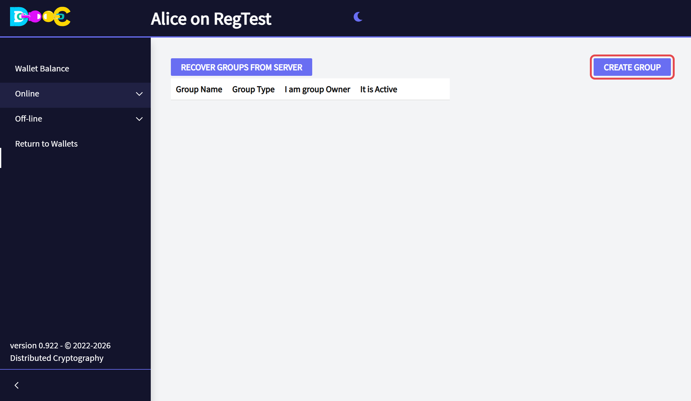

2. Choose the group type **Wallet Backup**, type a **name** for the group and click **Create**.

   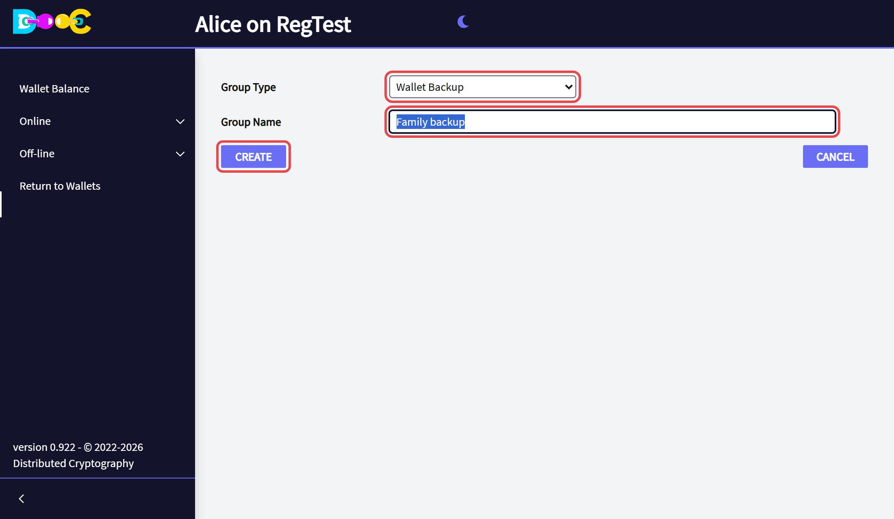

3. The group is in your list. Click its **name** to open it.

   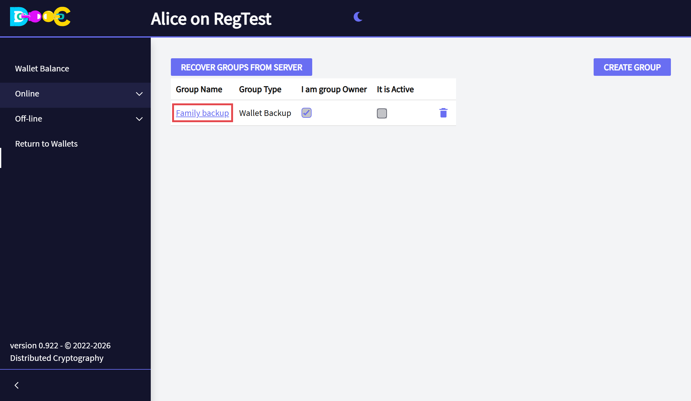

</Steps>

## 2. Add the members and invite them (owner)

<Steps>

1. Click **Add a contact**.

   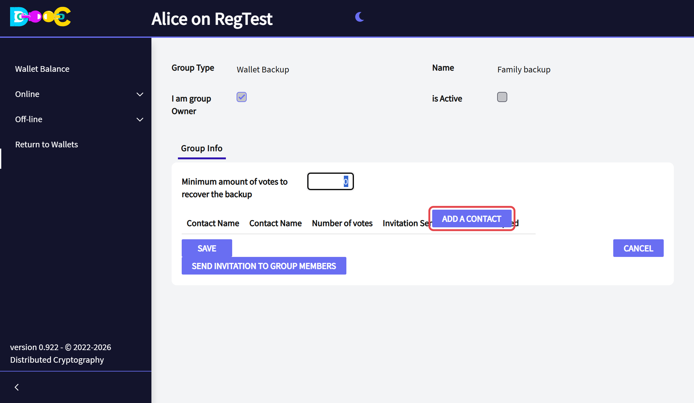

2. Click **Select Contact** next to the person. Repeat *Add a contact* for each member.

   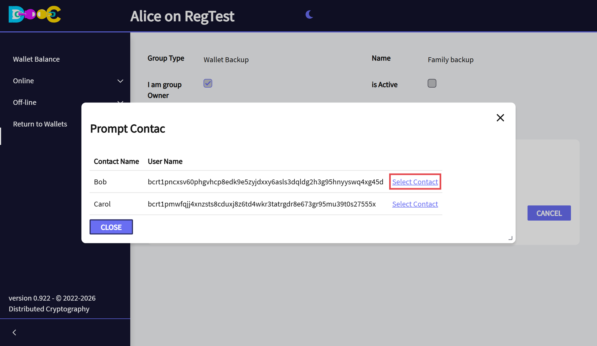

3. Set the **number of votes** of each member, and the **minimum amount of votes to recover the backup**. The
   minimum must be more than one. A member with more votes has more weight.

   Then click **Send invitation to group members**.

   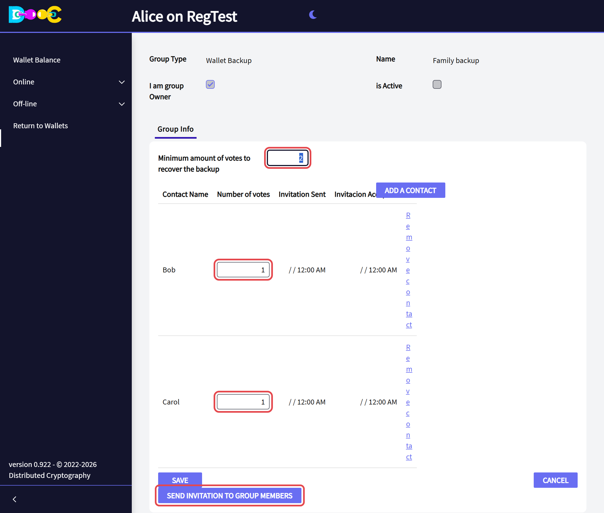

4. The app shows **All invitations sent**.

   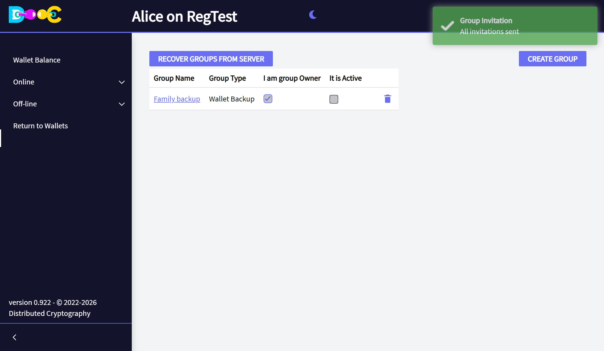

</Steps>

## 3. Accept the invitation (each member)

<Steps>

1. Open your wallet and open **Online → Smart Groups**. The group is in your list. Click **Accept Invitation**.

   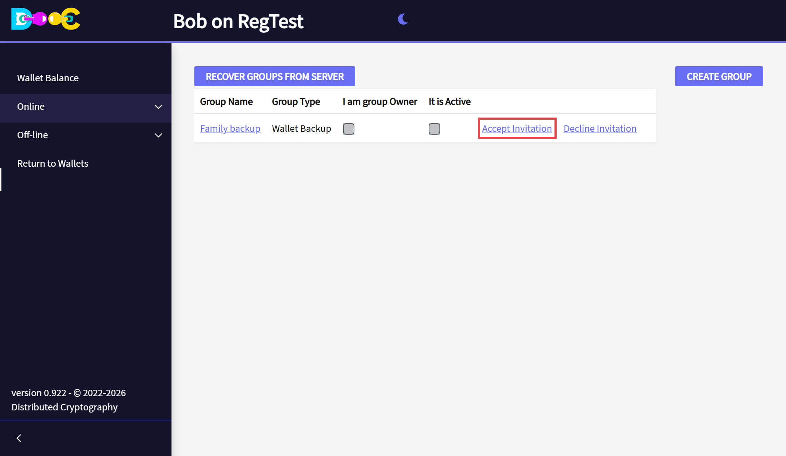

2. The group stays in your list. It is not active yet: the owner has to activate it.

   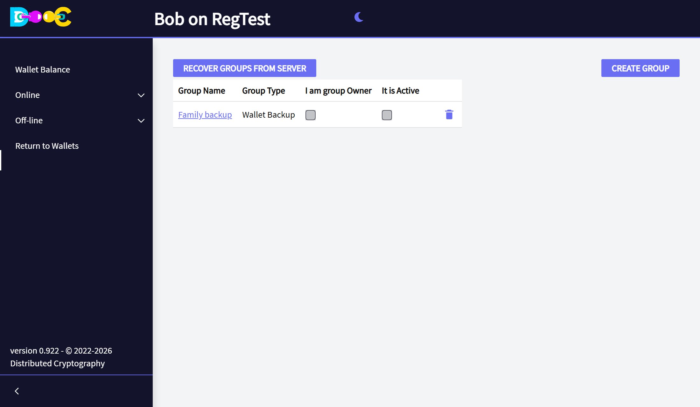

</Steps>

Invitations arrive when the member **opens their wallet**. If the group is not in the list yet, go back to the
wallets page and open the wallet again a little later.

## 4. Activate the group (owner)

<Steps>

1. Open the group again. When **every** member has accepted, the list shows the date each one accepted and the
   button **Activate Group** appears. Click it.

   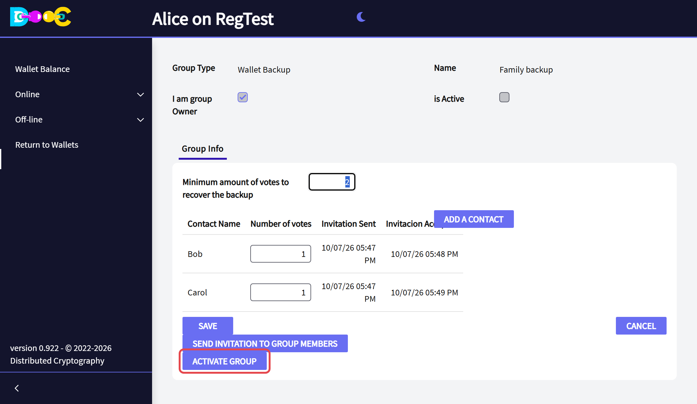

2. Type your **wallet password** and click **Confirm**.

   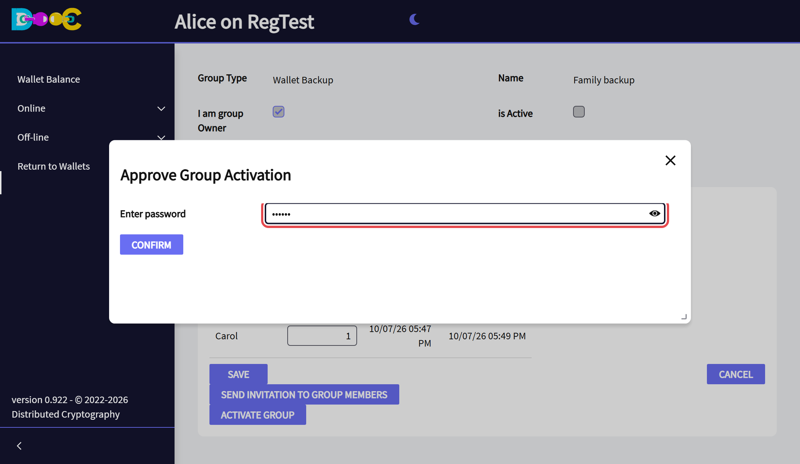

3. The group is now **active**, and it has a second tab, **Signatures**.

   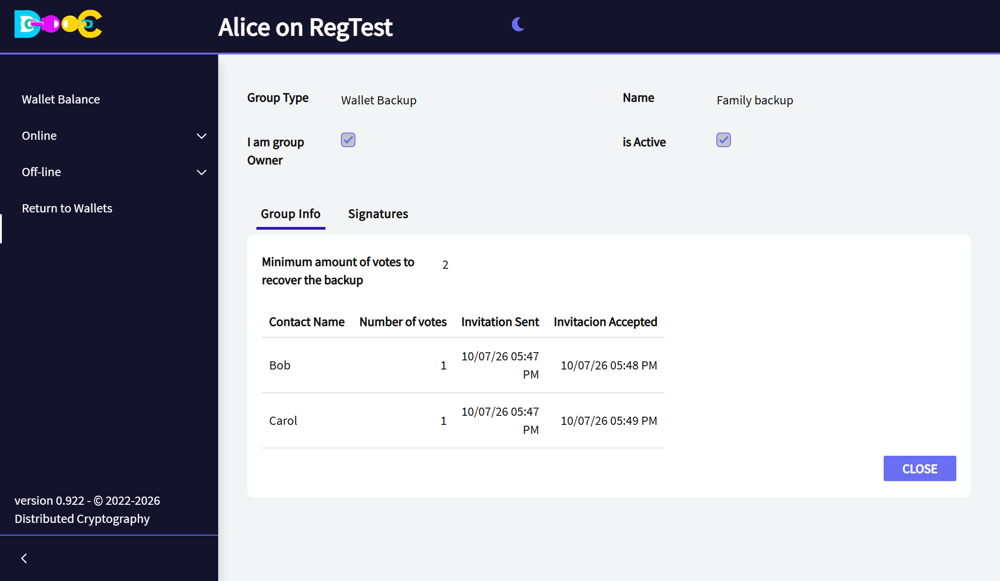

</Steps>

On activation your wallet secret is split on your computer. Each member's shares are encrypted **for that
member** before they leave it. Not even we can read them.

:::tip[What is backed up]
The backup holds the root of your wallet, so a restored wallet has everything that comes from it: your bitcoin,
your user name, and your place in your other groups.
:::

## Restore the wallet (members)

<Steps>

1. Each member who takes part opens the group in their own wallet and clicks **Restore Wallet**. This "signs"
   the restore: it reveals that member's shares to the other members.

   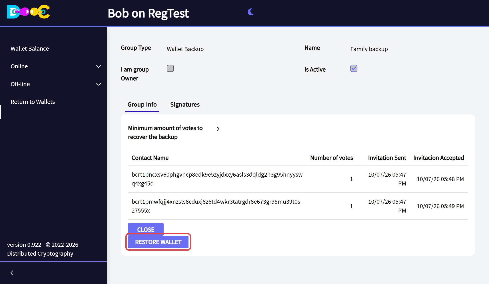

2. The app shows **The group has been notified**.

   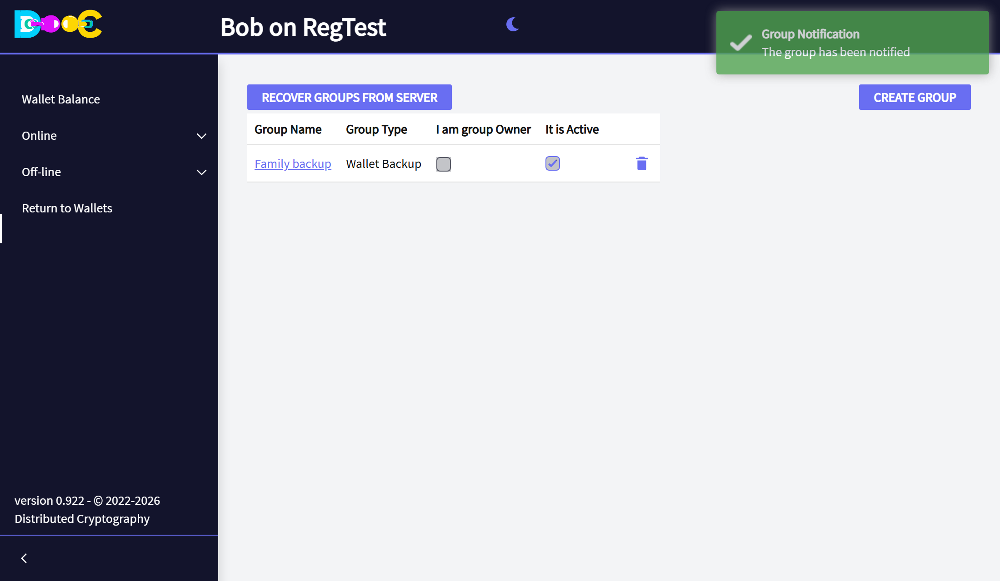

3. The **Signatures** tab of the group shows how far the restore is: here, *1 of 2 required shares signed*.

   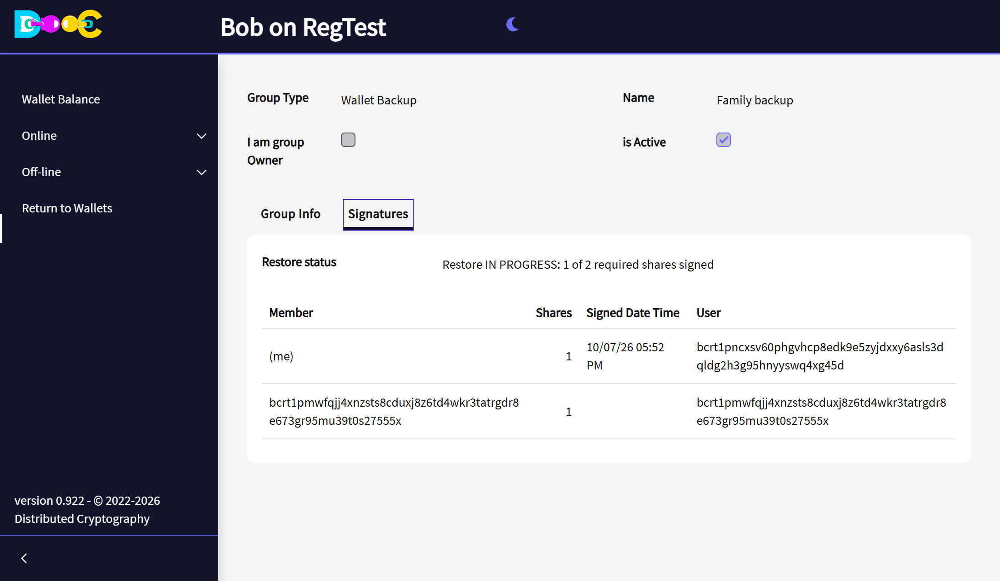

4. When the **minimum** has been reached, the button **Create recovered wallet** appears. A member clicks it,
   types a name and a new password, and the wallet is restored on that member's computer.

</Steps>

<YouTube id="sRo47Et5k1I" title="Restoring a Consensus Backup" />

## You stay in control: the Signatures tab (owner)

The **Signatures** tab shows who has signed a restore and when. While nothing is happening it says *No restore
in progress*.

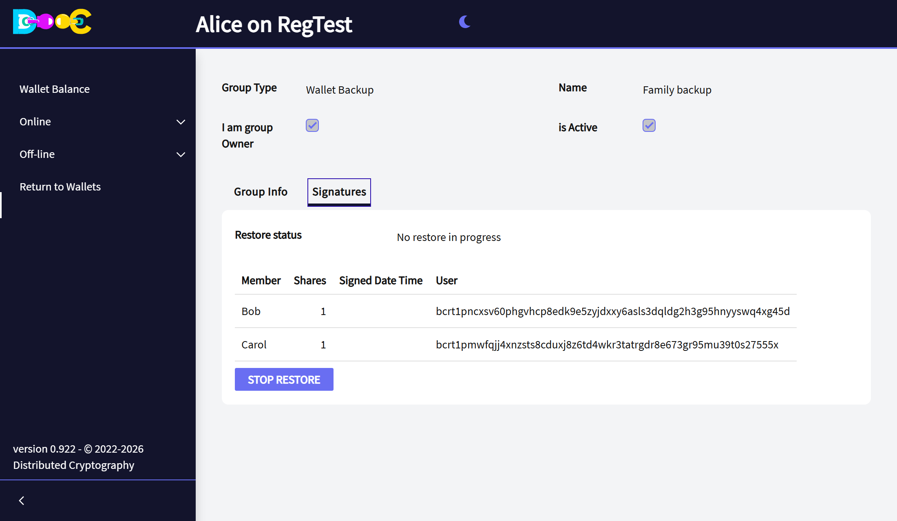

As the owner you get a **warning as soon as any member signs**, the next time you open your wallet. The tab then
shows *Restore IN PROGRESS*, with the member who signed and the time.

**If you did not ask for the restore, click Stop Restore.**

From then on members can neither sign nor create the recovered wallet, and the shares already revealed are
erased. The status changes to *Restore STOPPED by the owner*.

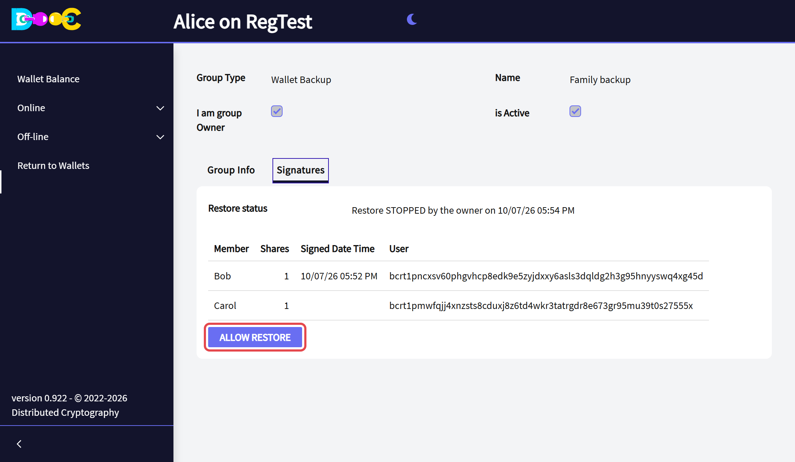

**Allow Restore** opens the group again and starts a new round of signatures.

:::danger[Stop it before the minimum is reached]
*Stop Restore* works while the restore is still **in progress**. Once the minimum has been reached, the secret
has already been rebuilt and it cannot be taken back. If that happens and you did not want it, **move your funds
to a new wallet at once**.
:::

## What you are trusting

Be clear about what this backup means before you choose the members:

- **Enough members together can restore your wallet without you.** That is the purpose. Choose people you trust,
  and choose a minimum high enough that it takes a real agreement.
- **After the minimum is reached, any member of the group can create the recovered wallet**, not only the ones
  who signed.
- The members of a group can see the user names of the other members.

## Video

<YouTube id="Myb05Qus5nQ" title="Creating a Consensus Backup" />

The videos were recorded with an earlier version. The pages look a little different today.

## Related

- [Restore a wallet](/wallet/restore/)
- [Time-Encrypted Vault](/groups/time-encrypted-vault/): the same idea, but the members can only restore after a
  date.
