import { Steps } from '@astrojs/starlight/components';

:::note[Next release]
This feature is part of the next release. It is not in the current download yet.
:::

Legacy Multisignature is the **classic bitcoin multisignature wallet**: any K of the N members can sign a
payment together. Every member is an equal signer, the owner included. In the app the group type is called
**Legacy Multi-Signature Wallet**.

Use it when you need a multisignature wallet that follows the long-established standards, for example to work
with other software or with existing procedures. If that is not a requirement,
[Delegated Multisignature](/groups/delegated-multisignature/) costs less in fees and shows less on the
blockchain.

| | |
|---|---|
| Addresses | SegWit P2SH-P2WSH (they start with `3`; with `2` on the test networks) |
| Members | Up to 16, the owner included |
| Keys | [BIP48](https://github.com/bitcoin/bips/blob/master/bip-0048.mediawiki), from each member's own wallet |
| Signing | [PSBT (BIP174)](https://github.com/bitcoin/bips/blob/master/bip-0174.mediawiki) |

In this guide **Alice**, **Bob** and **Carol** share the wallet *Company treasury*. Any **two of the three** can
approve a payment.

## Before you start

- You are [logged in](/online/).
- Every person you want in the group is an **accepted** [contact](/online/contacts/).

## 1. Create the group and invite the members (owner)

<Steps>

1. Open **Online → Smart Groups** and click **Create Group**. Choose the type
   **Legacy Multi-Signature Wallet**, type a name and click **Create**.

   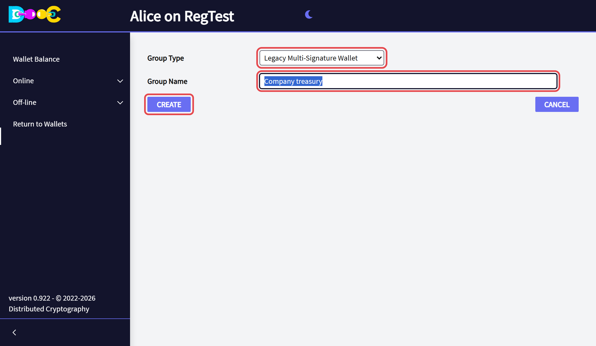

2. Open the group. Click **Add a contact** for each member. Set the
   **minimum amount of users to approve a spend**: this is the K of "K of N". You count as one of the N.

   Then click **Send invitation to group members**.

   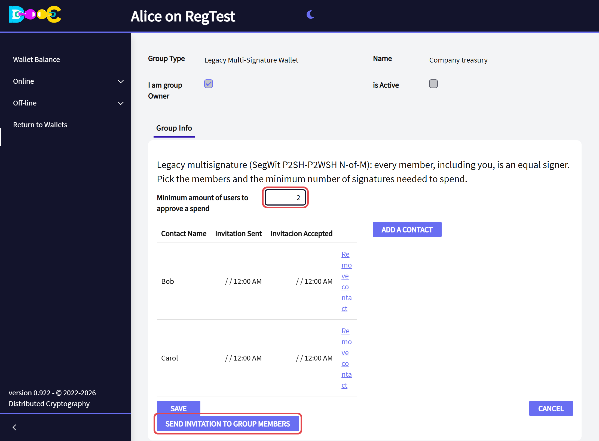

</Steps>

## 2. Accept the invitation (each member)

Open **Online → Smart Groups** in your own wallet and click **Accept Invitation** on the group's row.

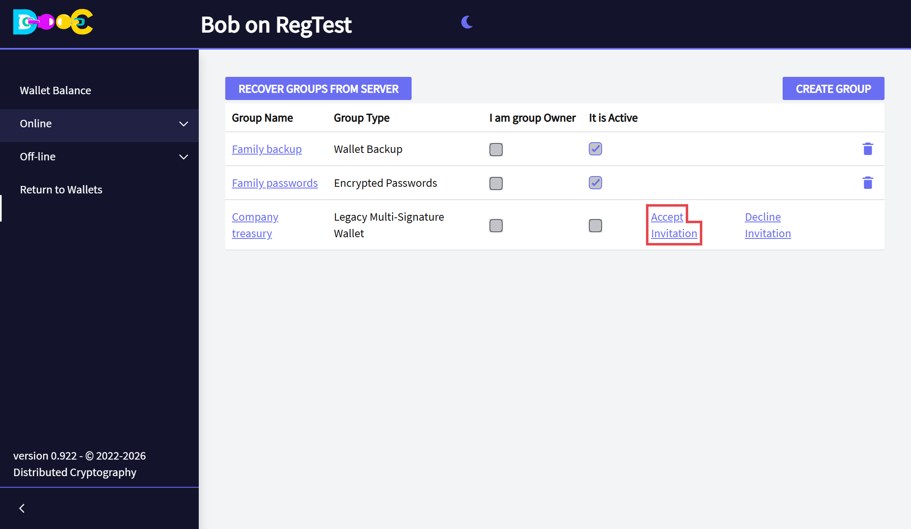

On accepting, your wallet sends the owner the public keys the group needs. No private key ever leaves a member's
wallet.

## 3. Activate the group (owner)

When every member has accepted, open the group and click **Activate Group**.

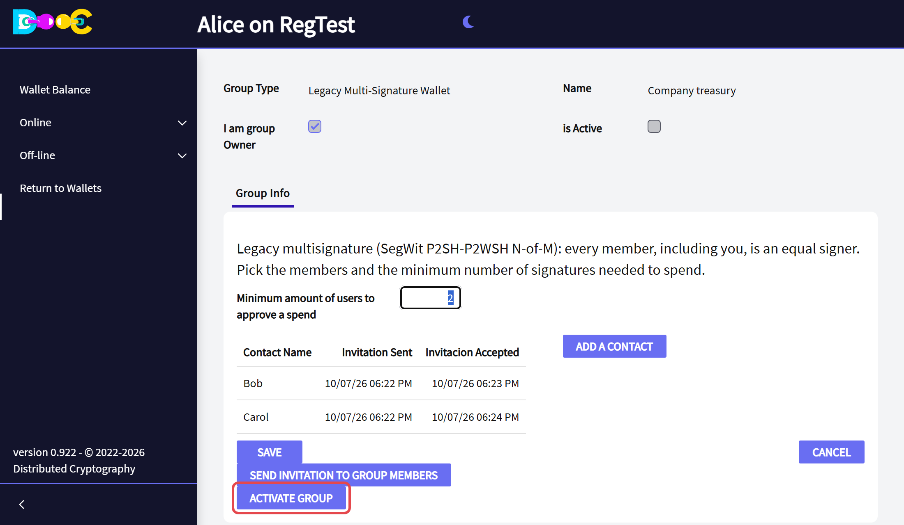

The group now has two more tabs: **Wallet Balance** and **Signatures**.

## 4. Receive

Open the group's **Wallet Balance** tab. It shows the **receiving address** of the group, as text and as a QR
code. Give it to whoever pays the group.

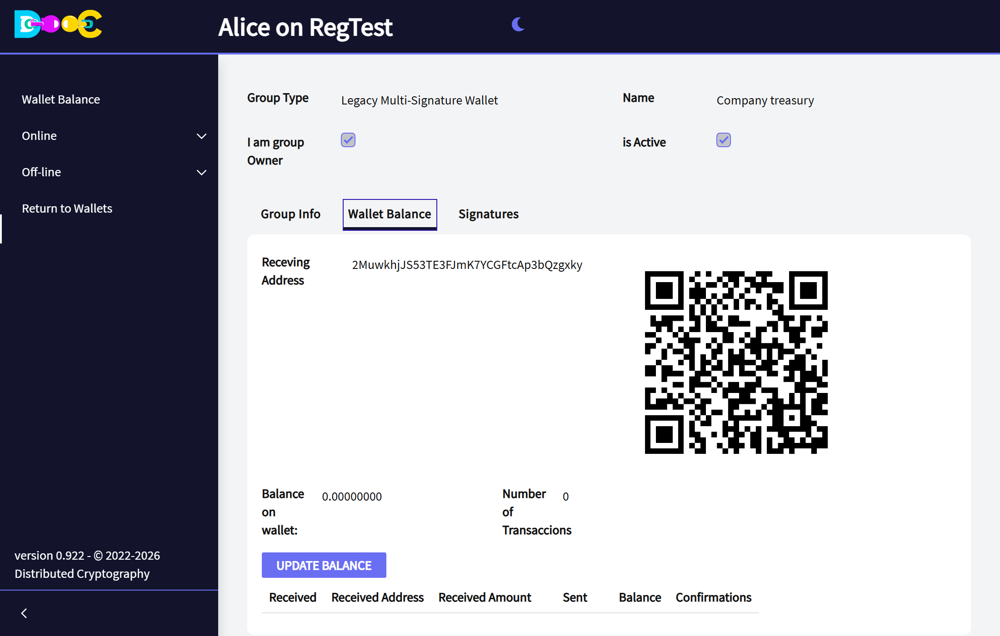

After a payment, click **Update Balance**. The page shows the balance and one line per payment, and the group
moves to a new receiving address.

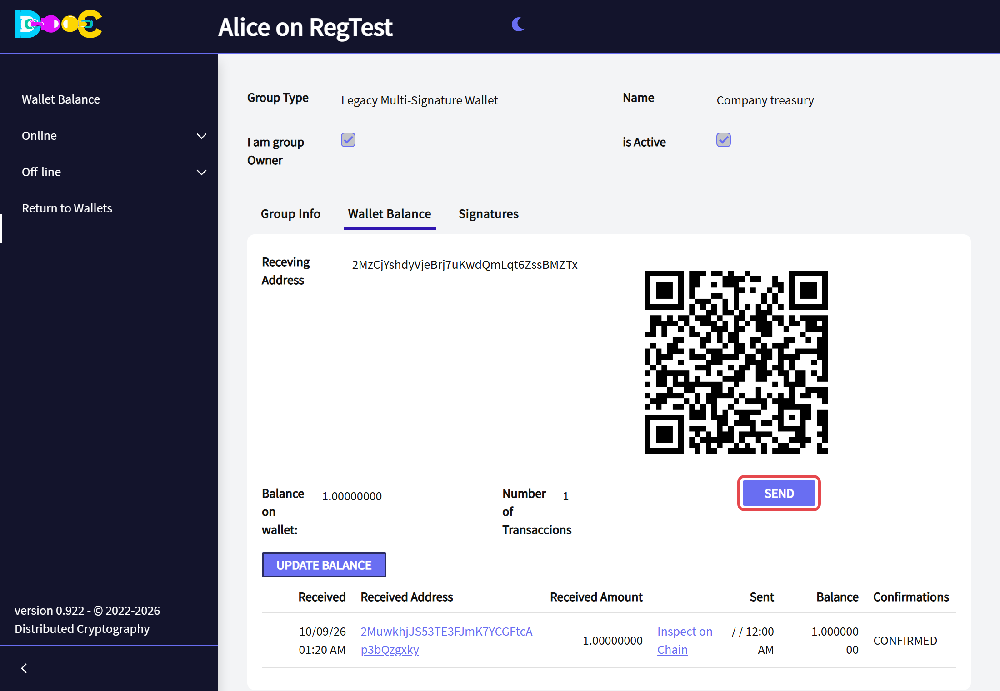

Every member sees the same wallet in their own *Wallet Balance* tab.

## 5. Start a payment (the first signer)

Any member can start a payment.

<Steps>

1. In the **Wallet Balance** tab click **Send**.

2. Type the **amount**, the **address** to pay and a **description**. The description is what the other members
   will see, so say what the payment is for. Click **Next**.

   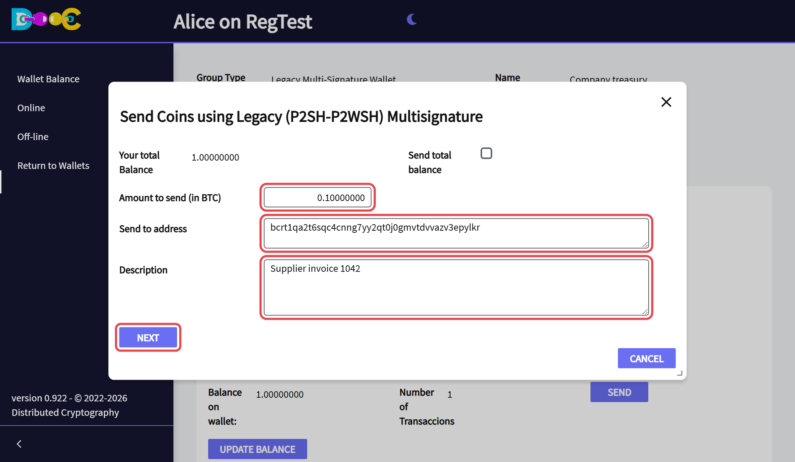

3. Type your **wallet password** and click **Confirm**.

   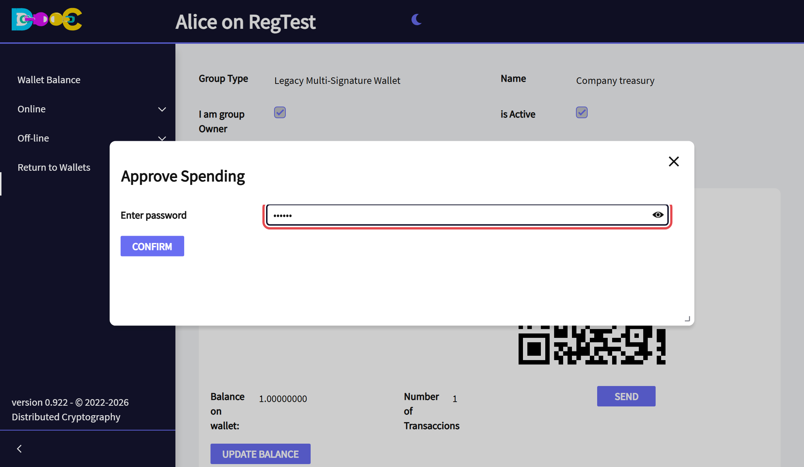

4. Choose the **fee**: one of the estimated levels in *Select Fee*, or tick *Manualy select Fee* and type your
   own. Click **Send Coins**.

   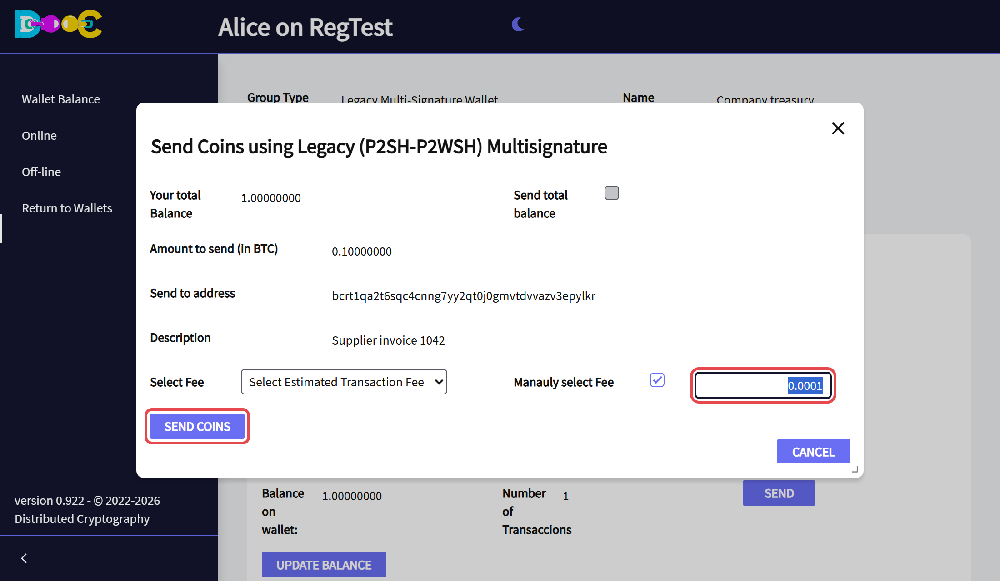

5. The app shows **Signature added: your signature was added and forwarded to the other signers**. Nothing has
   been sent to the bitcoin network yet: the payment waits for the other signatures.

</Steps>

The payment is now in the **Signatures** tab, with your signature and *Fully signed* still empty:

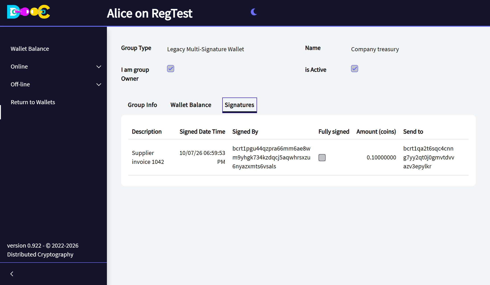

## 6. Sign the payment (each following signer)

<Steps>

1. Open your wallet, open the group and go to the **Signatures** tab. The payment is there with its description,
   who signed it, the amount and the address. Click **Sign transaction**.

   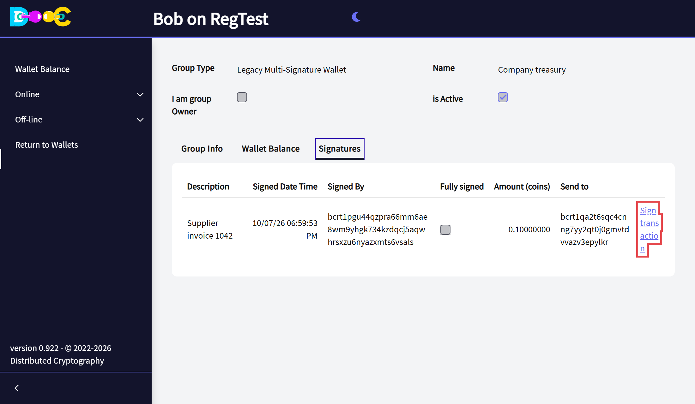

2. **Check the payment**: amount, address, description and fee. They cannot be changed. If it is what you agreed
   to, click **Next**.

   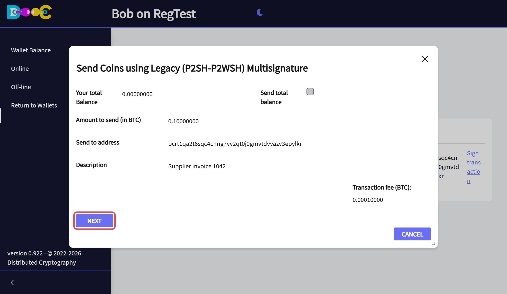

3. Type your **wallet password**, then click **Send Coins**.

   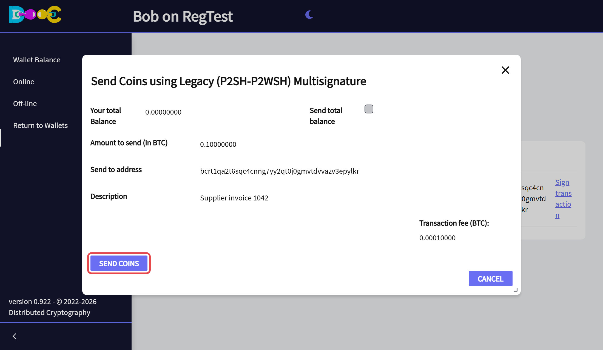

</Steps>

When the **last needed signature** is added, the app shows **Transaction broadcast**: the payment has been sent
to the bitcoin network. The *Signatures* tab shows it as *Fully signed*.

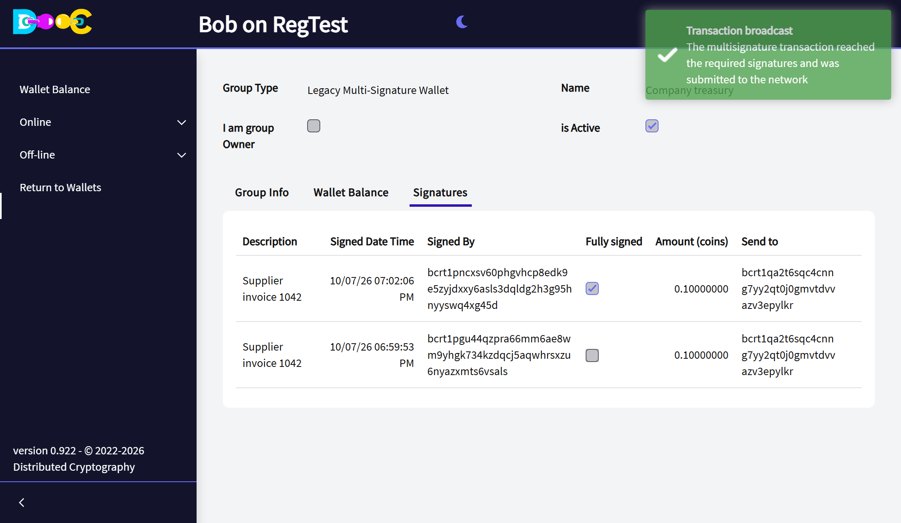

If more signatures are still needed (a 3-of-5 group, for example), your signature is added and the payment goes
on to the next signer in the same way.

After **Update Balance**, the *Wallet Balance* tab shows the new balance of the group:

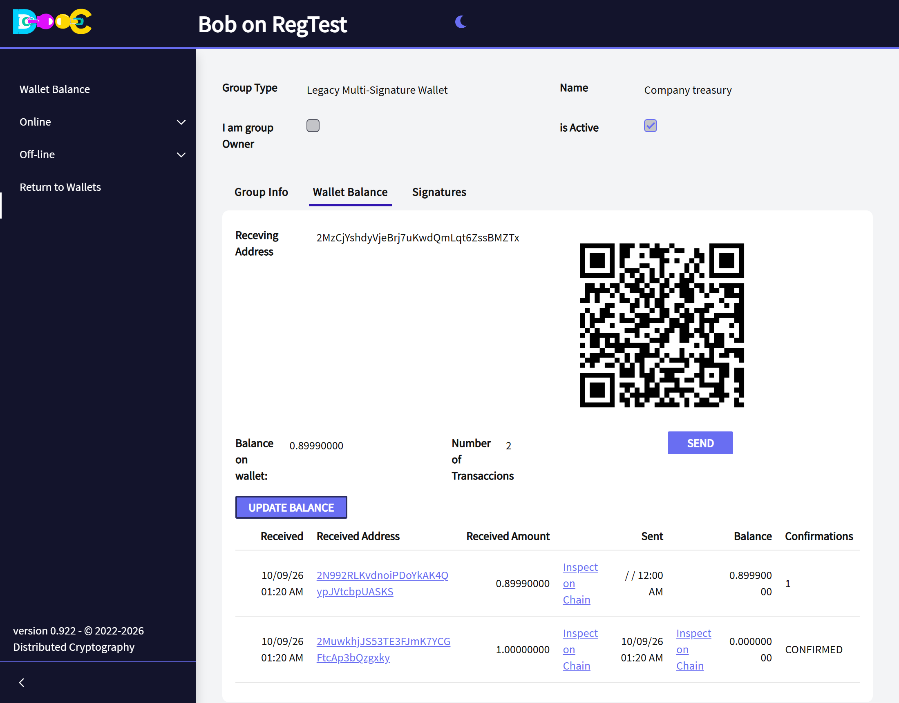

## Good to know

- **Signers do not have to be connected at the same time.** A payment to sign arrives when the member opens
  their wallet. If it is not in the *Signatures* tab yet, go back to the wallets page and open the wallet again
  a little later.
- **Check before you sign.** Sign only what you agreed to.
- **Backups.** Each member's keys for the group come from their own wallet. A member who restores their wallet
  from their words, or through a [Consensus Backup](/groups/consensus-backup/), can sign again.
- **Do not lose too many members.** If fewer than the minimum can still sign, the money is locked. Choose N and
  K with that in mind: 2-of-3 survives the loss of one member, 3-of-5 the loss of two.
