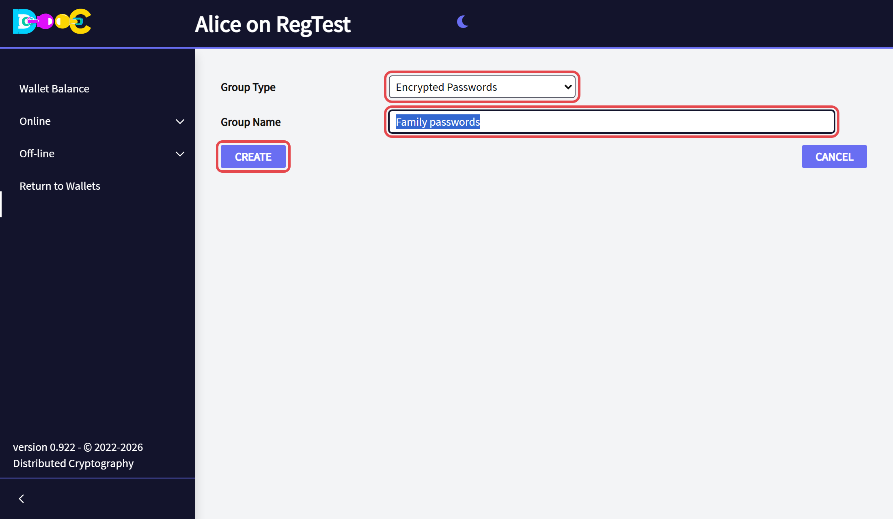
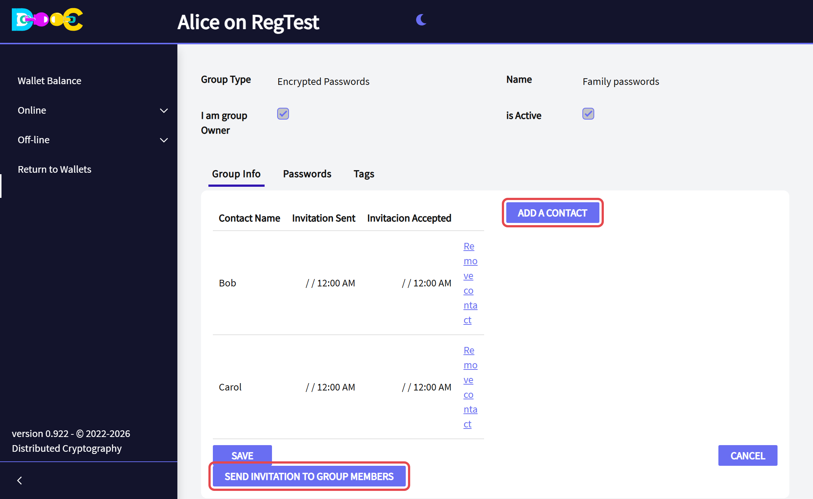
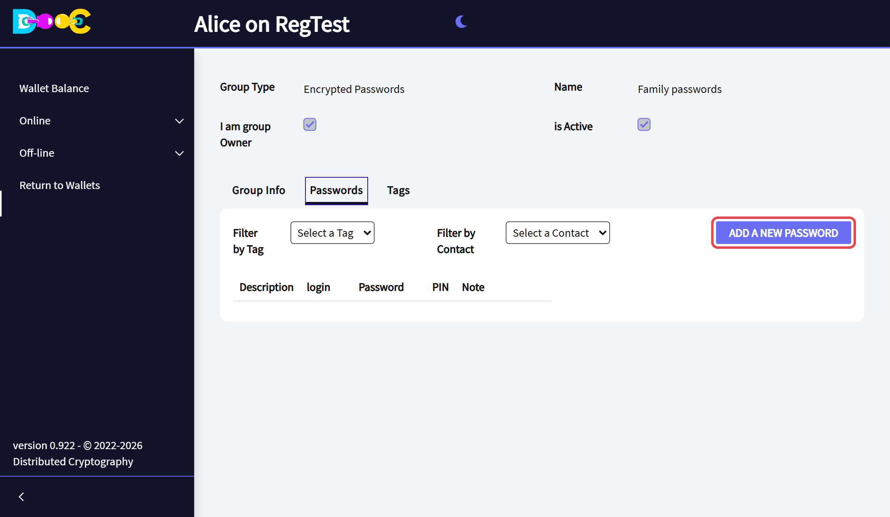
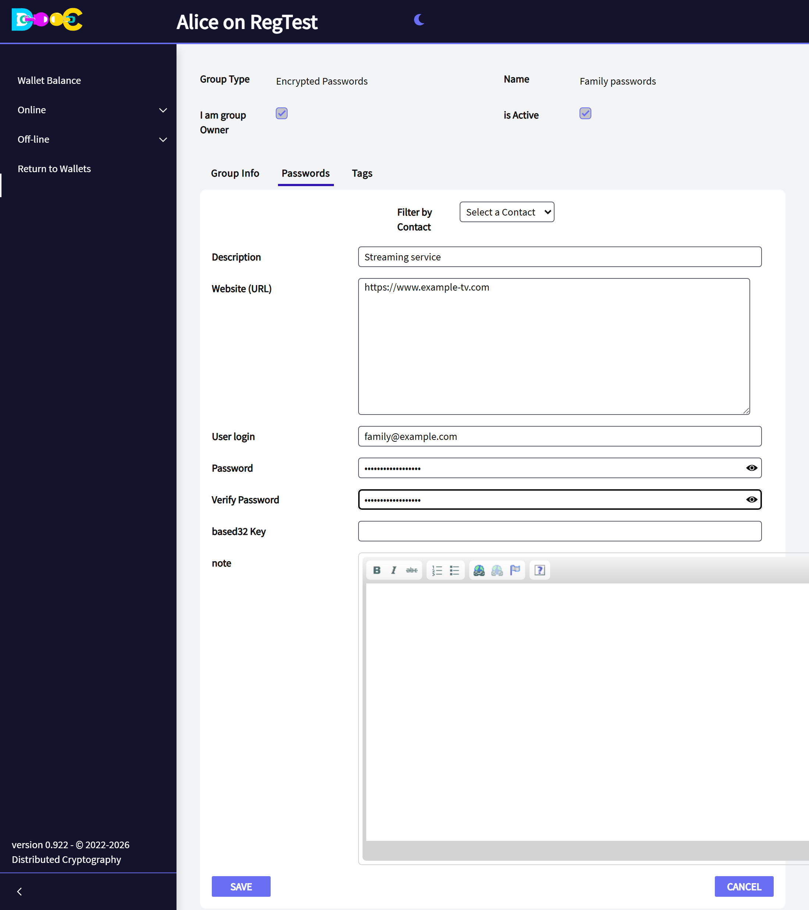
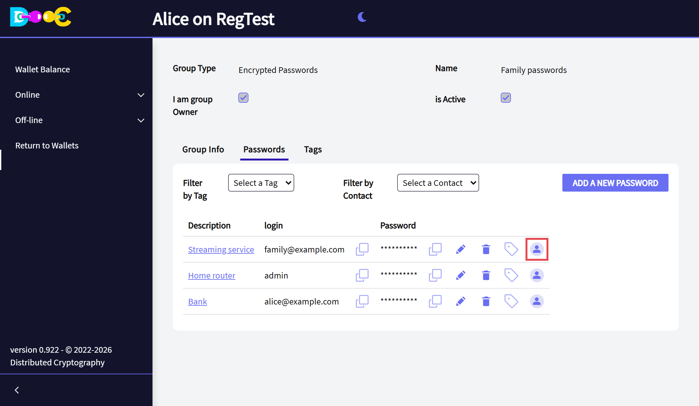
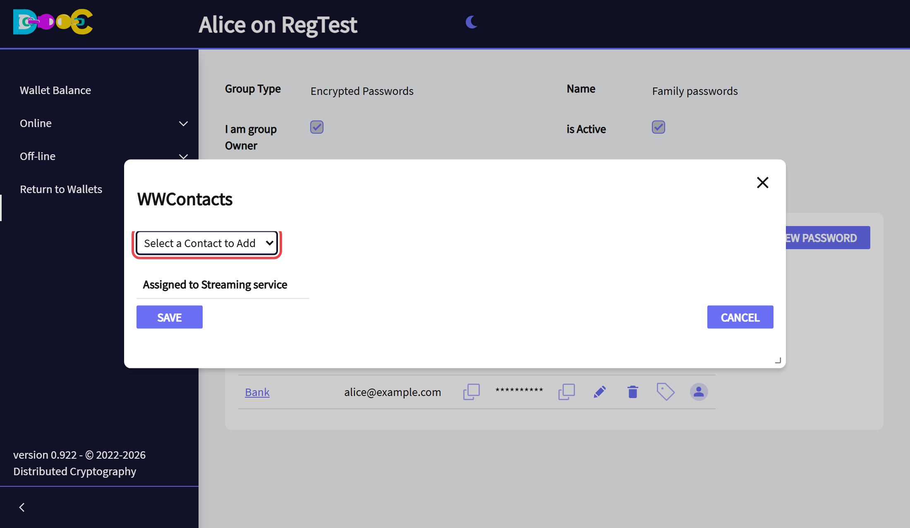
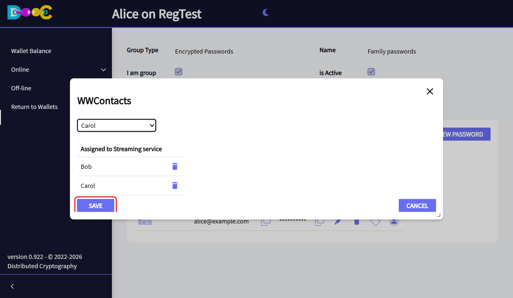
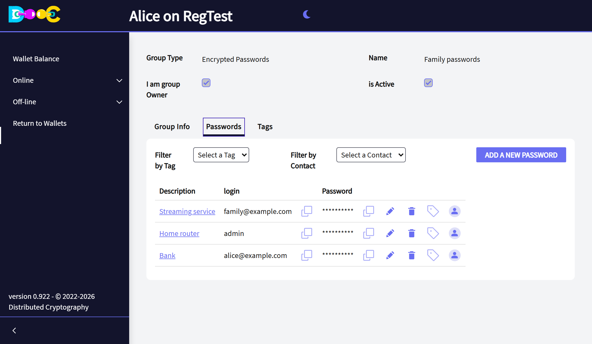
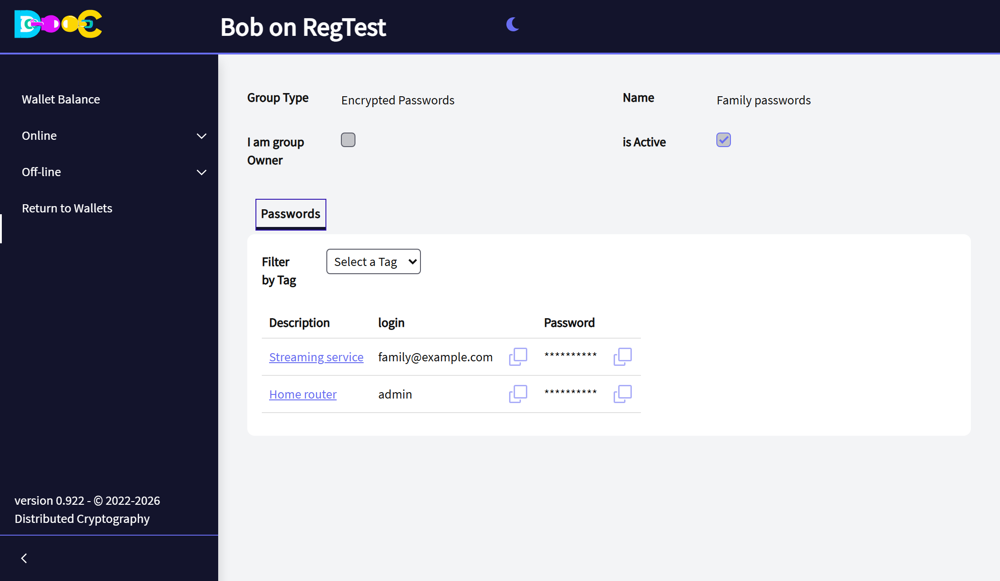
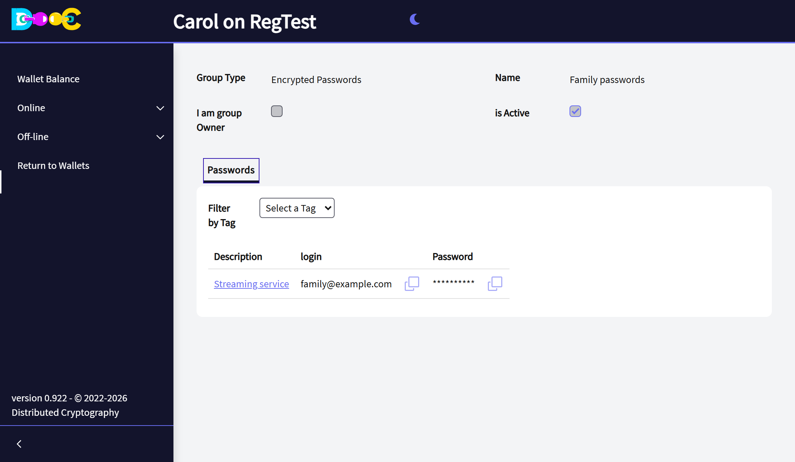

import { Steps } from '@astrojs/starlight/components';

A shared password vault is a Smart Group of type **Encrypted Passwords**. The owner keeps all the passwords and
decides, **password by password**, which members can see each one.

It holds the same kind of entry as your personal vault ([Encrypted passwords](/offline/passwords/)):
description, web address, login, password, authenticator key, a note and tags.

| | Can do |
|---|---|
| **Owner** | See everything. Add, edit and delete passwords. Choose who sees each one. Manage tags. |
| **Member** | See and copy **only the passwords shared with them**. Read-only. |

In this guide **Alice** creates the vault *Family passwords* with **Bob** and **Carol**. The streaming service is
for both, the home router only for Bob, and the bank for nobody.

## 1. Create the vault and invite people (owner)

<Steps>

1. Open **Online → Smart Groups**, click **Create Group**, choose the type **Encrypted Passwords**, type a name
   and click **Create**.

   

2. Open the group. In the tab **Group Info**, click **Add a contact** for each member, then
   **Send invitation to group members**.

   

3. Each member opens **Online → Smart Groups** in their own wallet and clicks **Accept Invitation**.

</Steps>

A password vault needs no activation: it is active from the start. A member can be given passwords once they
have accepted.

## 2. Add a password (owner)

<Steps>

1. Open the group, go to the tab **Passwords** and click **Add a new password**.

   

2. Fill in the entry and click **Save**. The fields are the same as in
   [Encrypted passwords](/offline/passwords/#add-a-password).

   

</Steps>

A new password is **only yours** until you share it.

## 3. Choose who sees a password (owner)

<Steps>

1. Click the **person icon** at the end of the entry's row.

   

2. Choose a member in **Select a Contact to Add**. Repeat for each member who should see this password.

   

3. The members are listed under *Assigned to …*. Click **Save**.

   

</Steps>

The owner always sees every password:

**Filter by Contact** shows the passwords shared with one member. **Filter by Tag** and the **Tags** tab
organise the list; tags do not decide who sees a password.

## What each member sees

A member opens the group and sees **only the passwords shared with them**, with the icons to copy the login and
the password. There is nothing to add, edit or delete.

Bob has the streaming service and the home router:

Carol has only the streaming service:

## Use a password

On each entry, owner and members can:

- **Copy** the login and the password to the clipboard, with the icon next to each one.
- **Copy the PIN**: if the entry has an authenticator key, this gives the current 6-digit code. The key itself is
  never shown.
- Open the **note** of the entry, if it has one.

## Stop sharing

Click the **person icon** of the entry, click the **trash can** next to the member, and save. Their copy is
rewritten without that password.

Remember that a person who could see a password may have copied it. When someone should no longer have access,
**change the password itself** on the web site as well.

## How it is protected

- The whole vault is encrypted **for the owner's key**. Only the owner's wallet can open it.
- Each member receives **their own copy, with only their passwords, encrypted for their own key**. A member
  cannot read what was not shared with them, not even by looking at the stored data directly.
- Passwords are sent to the page one at a time, only when you ask to copy or see one.
- If the owner restores their wallet on another computer, the vault opens again there. The same is true for
  each member and their part.

:::tip[If your vault was created with an earlier version]
Open it and save any change (edit an entry, for example). That save rewrites the vault with the protection
described above.
:::
