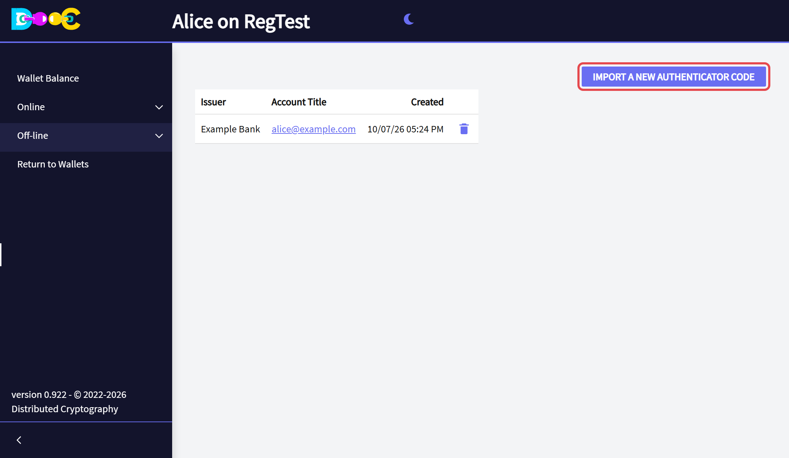
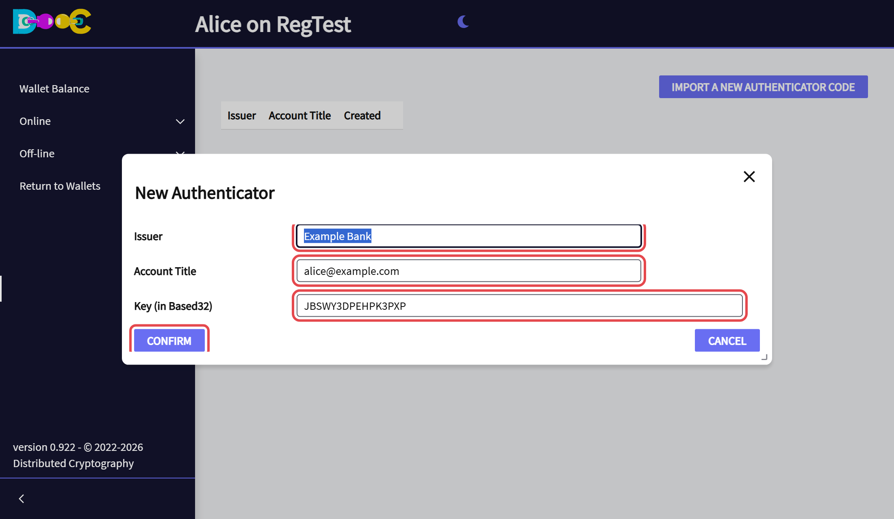
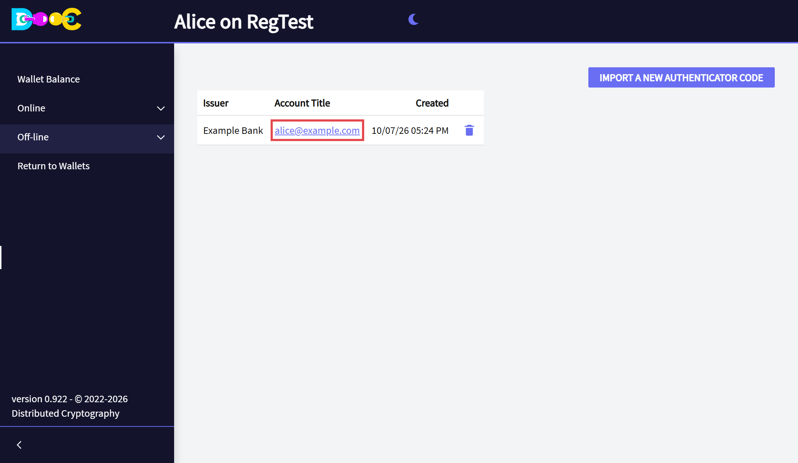
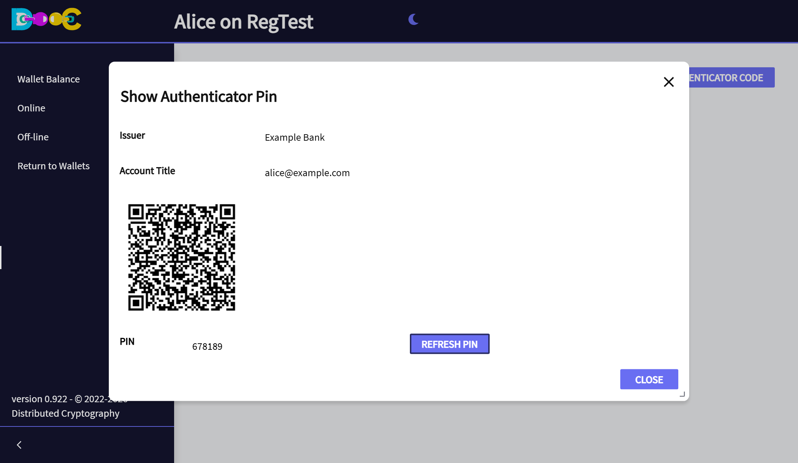

import { Steps } from '@astrojs/starlight/components';

Many sites protect your account with an authenticator app on your phone that shows a 6-digit code. If you lose
the phone, you lose the codes, and often the account.

**Off-line → Autheticators** keeps a copy of those authenticators inside your wallet. You can read the current
code from the wallet, and put the authenticator back on a new phone.

## Add an authenticator

You need the **key** of the authenticator. When a site turns on two-factor authentication it shows a QR code,
and usually a link such as *"can't scan the code?"* that shows the same key as text (letters and numbers). Copy
that text **when you set up the site**; most sites never show it again.

<Steps>

1. Open **Off-line → Autheticators** and click **Import a new Authenticator Code**.

   

2. Type the **issuer** (the site), the **account title** (your user on that site) and the **key**. Click
   **Confirm**.

   

3. The authenticator is in the list.

   

</Steps>

## Get a code

Click the **account title** in the list. The window shows the current **PIN**. A code is valid for a short
time: click **Refresh PIN** to get the current one.

## Put an authenticator on a new phone

The same window shows a **QR code**. Scan it with the authenticator app of the new phone, and the app shows the
same codes as before.

## Delete an authenticator

Click the **trash can** on its row and confirm.

## Good to know

- Whoever has the key can produce the codes. That is why it is kept encrypted, in your wallet folder.
- This list is separate from the *based32 Key* of an entry in [Encrypted Passwords](/offline/passwords/). Use
  whichever you find more convenient.
- Include your wallet folder in your backups.
