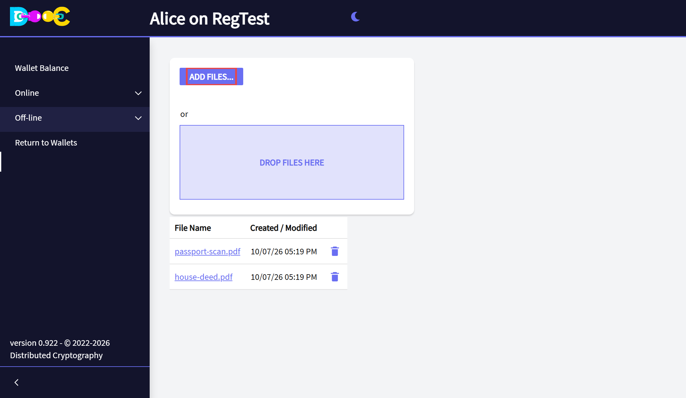
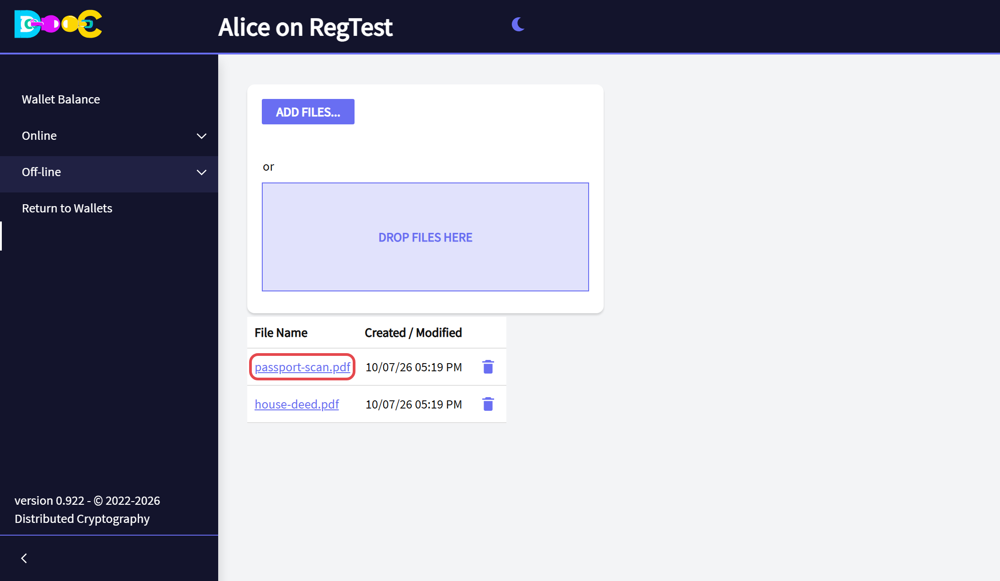
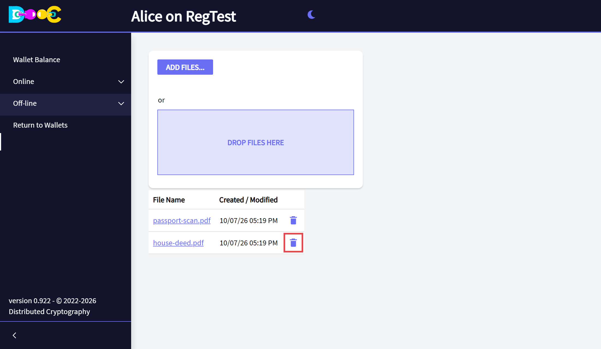

import { Steps } from '@astrojs/starlight/components';

**Off-line → Encrypted Files** keeps files encrypted inside your wallet. Use it for documents you want to have
at hand but never want lying around unprotected: scans of your papers, contracts, backups of other keys.

## Add a file

<Steps>

1. Open **Off-line → Encrypted Files**. Click **Add files...** and choose the file, or drop it on
   **Drop files here**.

   

2. The file appears in the list with its name and its date.

   

</Steps>

The file is encrypted **for your own wallet** and stored in your wallet folder under a random name. The name you
see in the list is encrypted too.

The file you uploaded is still where it was on your disk, unencrypted. Delete that copy yourself if you only
want to keep the encrypted one.

## Get a file back

Click the **name of the file** and confirm. Your browser downloads it, decrypted, with its original name.

## Delete a file

Click the **trash can** on the file's row and confirm.

## Good to know

- The size limit in the browser is **1 GB** per file. For larger files, use the
  [exchange folder](/online/send-files/#large-files-no-upload) and encrypt the file for your own user name.
- Only your wallet can open these files. To give a file to another person, see
  [Send encrypted files](/online/send-files/).
- The files live in your **wallet folder**. Include it in your backups: your words do not bring the files back.
- Any change to a stored file is detected when you open it. A damaged file is rejected, never half-opened.

:::note[If you update from an earlier version]
The next release uses a new file format (DCF2) and does not read files stored with earlier versions. **Download
your files with the version that stored them before you update**, then add them again.
:::
