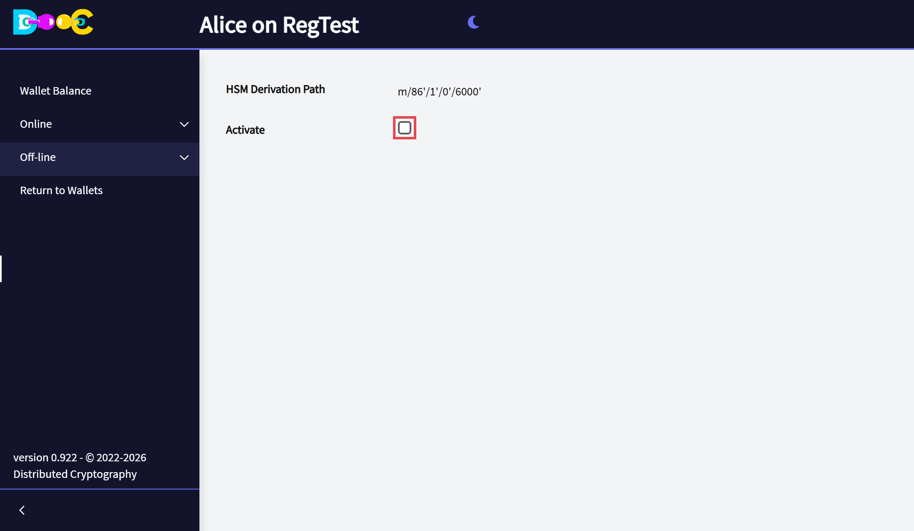

import YouTube from '../../../components/YouTube.astro';
import { Steps } from '@astrojs/starlight/components';

## What is an HSM?

An **HSM (Hardware Security Module)** is a dedicated physical device that creates, stores and protects
cryptographic keys, and does the secure operations with them: encrypting, decrypting, signing and managing
keys. Think of it as a tamper-proof vault for cryptographic secrets, used where security in software alone is
not enough.

Our HSM is not, strictly speaking, hardware. It is a service of the wallet that does the same job: **your
programs ask it to sign or decrypt, and the keys never leave it**. You can install it on a dedicated device
such as a Raspberry Pi, or in its own virtual machine or container, and allow access only from the service that
needs it.

<YouTube id="GRo7Rbxk-Pc" title="How to set up an HSM" />

## Turn it on

<Steps>

1. Open your wallet and open **Off-line → HSM**.

2. Tick **Activate** and click **Save**.

   

3. The app shows *HSM Ready* and goes back to the wallets page. **Open the wallet again**: the HSM starts when
   the wallet is unlocked.

</Steps>

The page shows the **HSM derivation path**: the keys the HSM uses come from that branch of your wallet, so they
are covered by the same words and the same backups.

To turn it off, clear **Activate** and save.

## Use it from your programs

The HSM is a REST service at:

```
http://<the computer that runs the wallet>:5000/HSM/rest/...
```

The description of the service (OpenAPI) is the file
[`HSM.rest.yaml`](https://github.com/angelonardone/DistributedCryptography/blob/main/web/HSM.rest.yaml). Use it
to generate a client or to see every operation and its parameters.

:::danger[The service has no authentication]
Anyone who can reach the port can ask the HSM to sign. **Never open it to a network you do not trust.**

- Run it on a dedicated machine, virtual machine or container.
- Use a firewall so that only the service that needs it can connect.
- With Docker, publish the port only on your own machine: `127.0.0.1:5000:5000`. See
  [Run with Docker](/install/docker/).
:::
