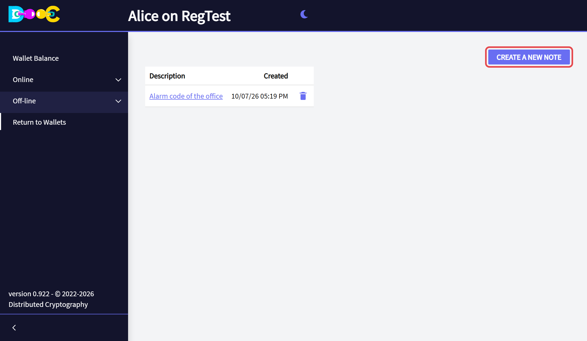
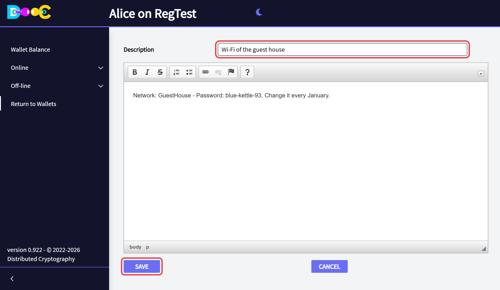
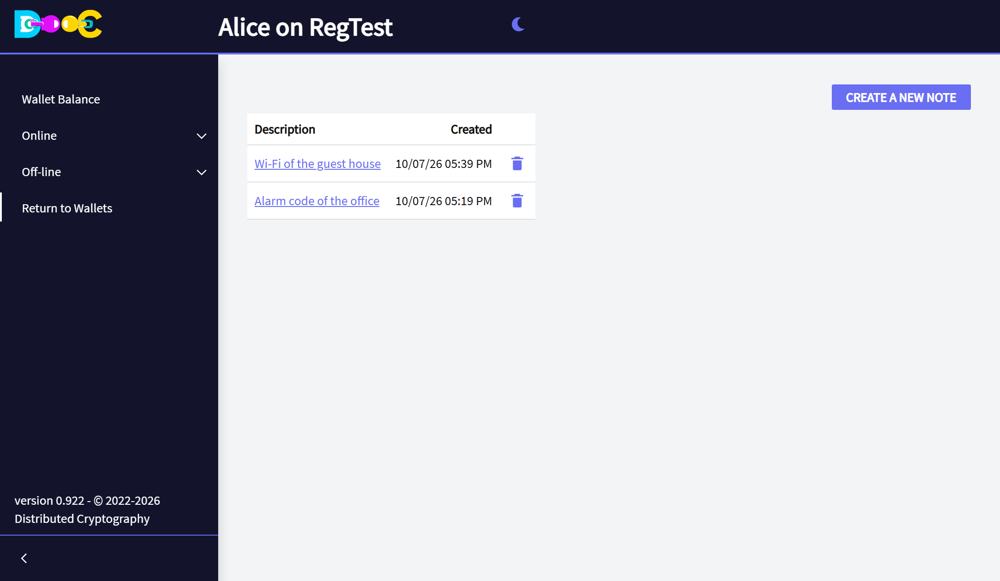

import { Steps } from '@astrojs/starlight/components';

**Off-line → Encrypted Notes** keeps any number of private notes: codes, instructions for your family, account
details, anything you would not leave in a plain text file.

## Write a note

<Steps>

1. Open **Off-line → Encrypted Notes** and click **Create a new note**.

   

2. Type a **description**: it is the title you will see in the list. Write the note in the box below. You can
   use bold, italics, lists and links. Click **Save**.

   

3. The note is in the list, with the date it was created.

   

</Steps>

## Read or change a note

Click its **description** in the list. Change what you need and click **Save**.

## Delete a note

Click the **trash can** on its row and confirm.

## Good to know

- Each note is a separate encrypted file in your wallet folder. The description is encrypted with it.
- Notes are not copied anywhere else. Include your wallet folder in your backups.
