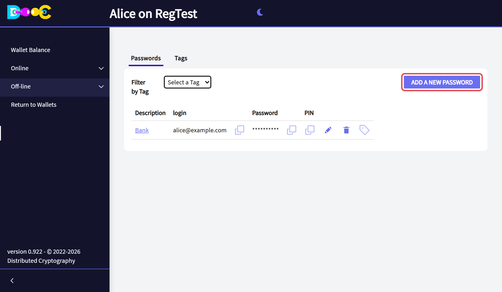
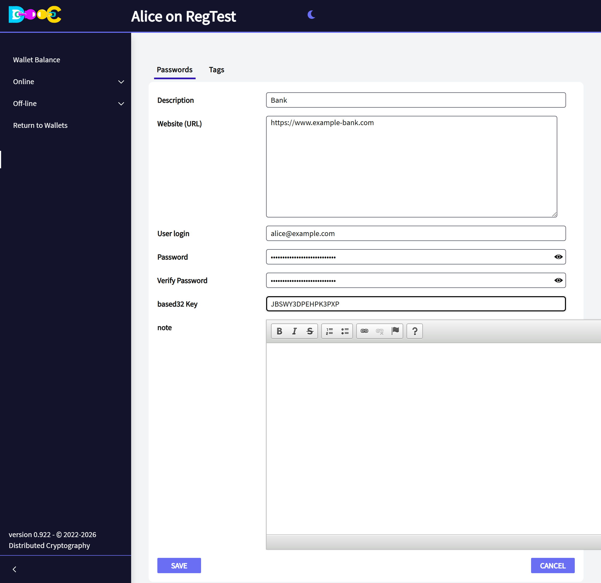
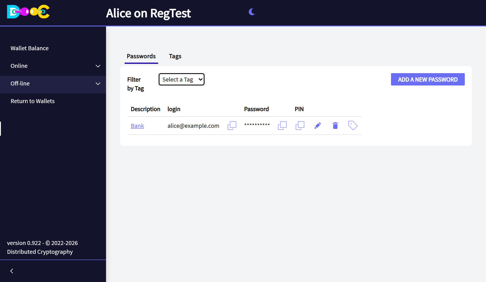

import { Steps } from '@astrojs/starlight/components';

**Off-line → Encrypted Passwords** is a password manager that only your wallet can open.

## Add a password

<Steps>

1. Open **Off-line → Encrypted Passwords** and click **Add a new password**.

   

2. Fill in the entry and click **Save**.

   | Field | What to type |
   |---|---|
   | **Description** | The name you will see in the list |
   | **Website (URL)** | The address of the site |
   | **User login** | Your user or e-mail on that site |
   | **Password** and **Verify Password** | The password, twice. The eye shows what you typed. |
   | **based32 Key** | Optional. The key of the site's two-factor authentication, to get its 6-digit codes here. |
   | **note** | Optional. Anything else you want to keep with this entry. |

   

3. The entry is in the list. The password is not shown.

   

</Steps>

## Use an entry

The icons on each row, from left to right:

- **Copy** next to the login: puts the login on the clipboard.
- **Copy** next to the password: puts the password on the clipboard.
- **Copy** under *PIN*: puts the current 6-digit code on the clipboard, if the entry has a *based32 Key*.
- **Pencil**: edit the entry.
- **Trash can**: delete the entry.
- **Tag**: choose the tags of the entry.

Passwords are never shown on the list. One is read only when you ask to copy it.

## Tags

Tags organise the list when it grows: *Banks*, *Work*, *Family*. Create them in the **Tags** tab, give them to an
entry with its tag icon, and use **Filter by Tag** to see only the entries with one tag.

## Where it is kept

In your wallet folder, encrypted with a key that comes from your wallet. Include that folder in your backups.

## Share passwords with other people

To share some passwords with your family or your team, and decide who sees which one, use a
[shared password vault](/groups/shared-passwords/).
