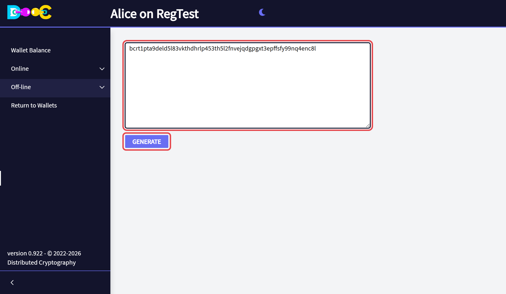
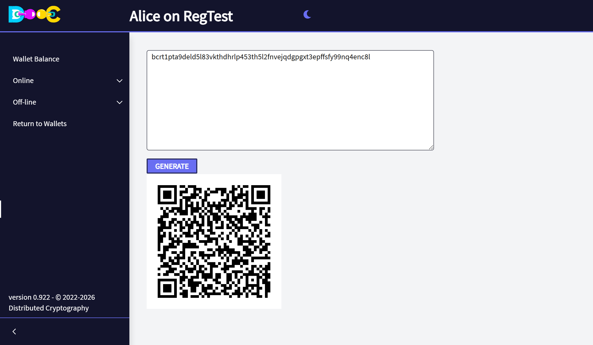

import { Steps } from '@astrojs/starlight/components';

**Off-line → Create QRCodes** turns any text into a QR code: an address, a user name, a share of a secret. The
code is made on your computer, so the text is not sent to any web site.

<Steps>

1. Open **Off-line → Create QRCodes**, type or paste the text, and click **Generate**.

   

2. The QR code appears below. Save the picture with the right button of the mouse, or print the page.

   

</Steps>

:::caution
A QR code is only another way of writing the text. Anyone who scans it reads the text. Treat a QR code of a
secret as carefully as the secret itself.
:::
