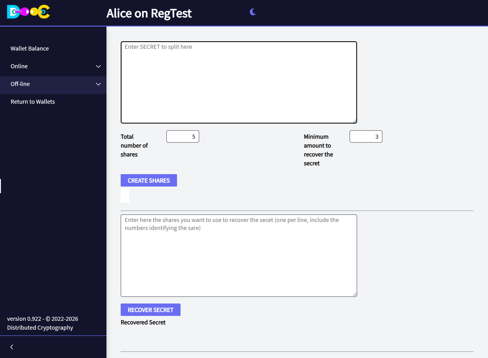
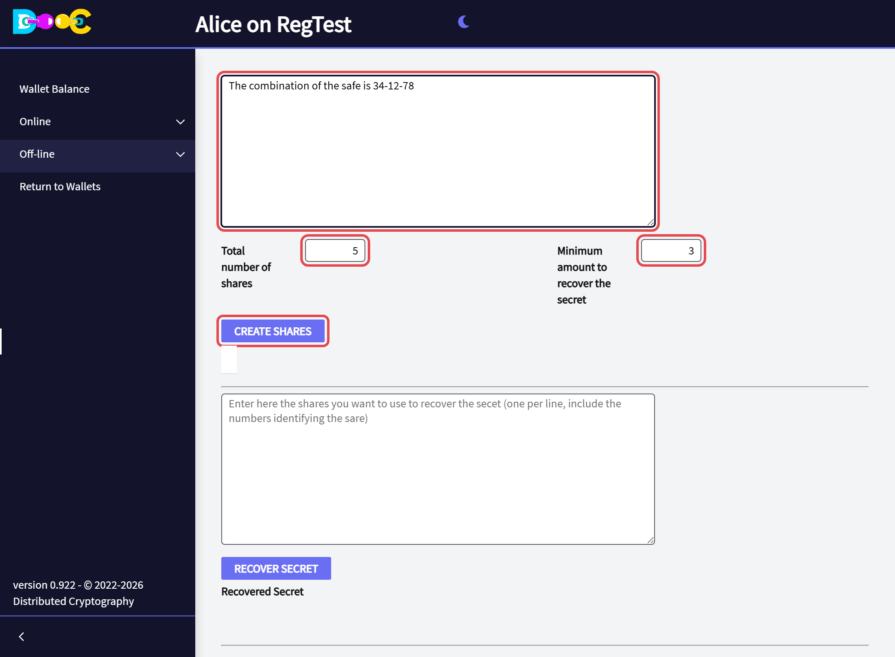
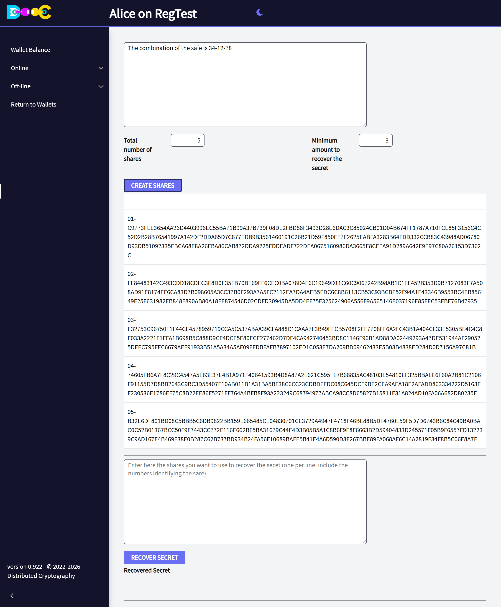
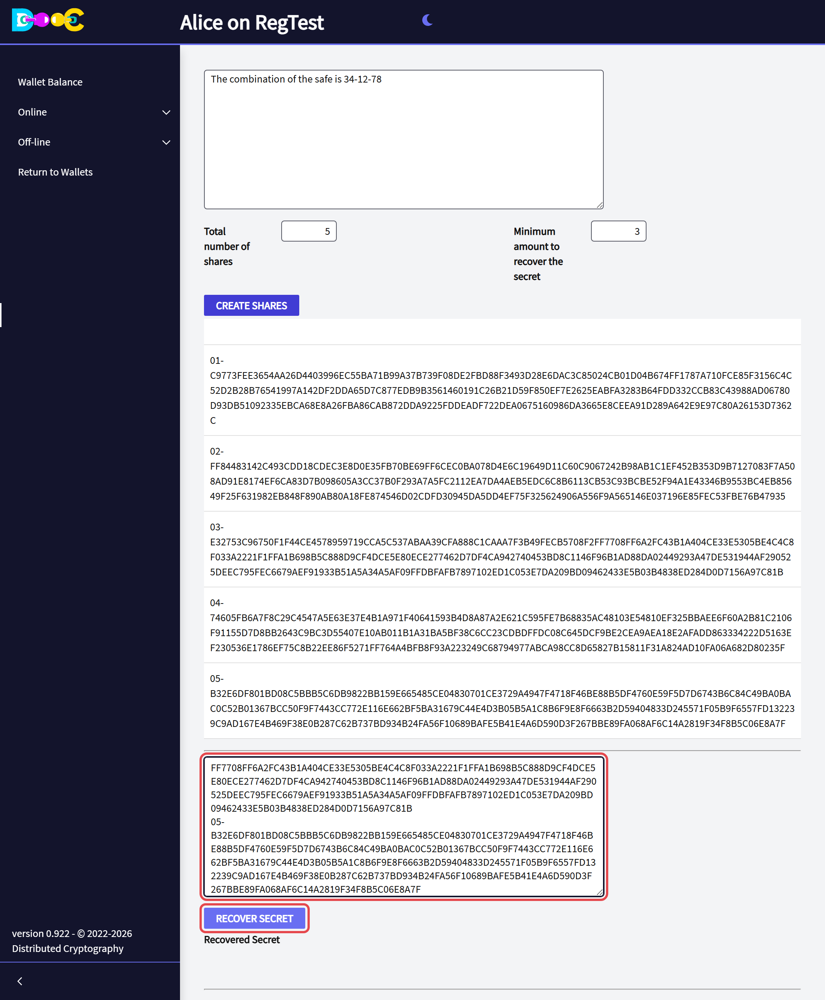
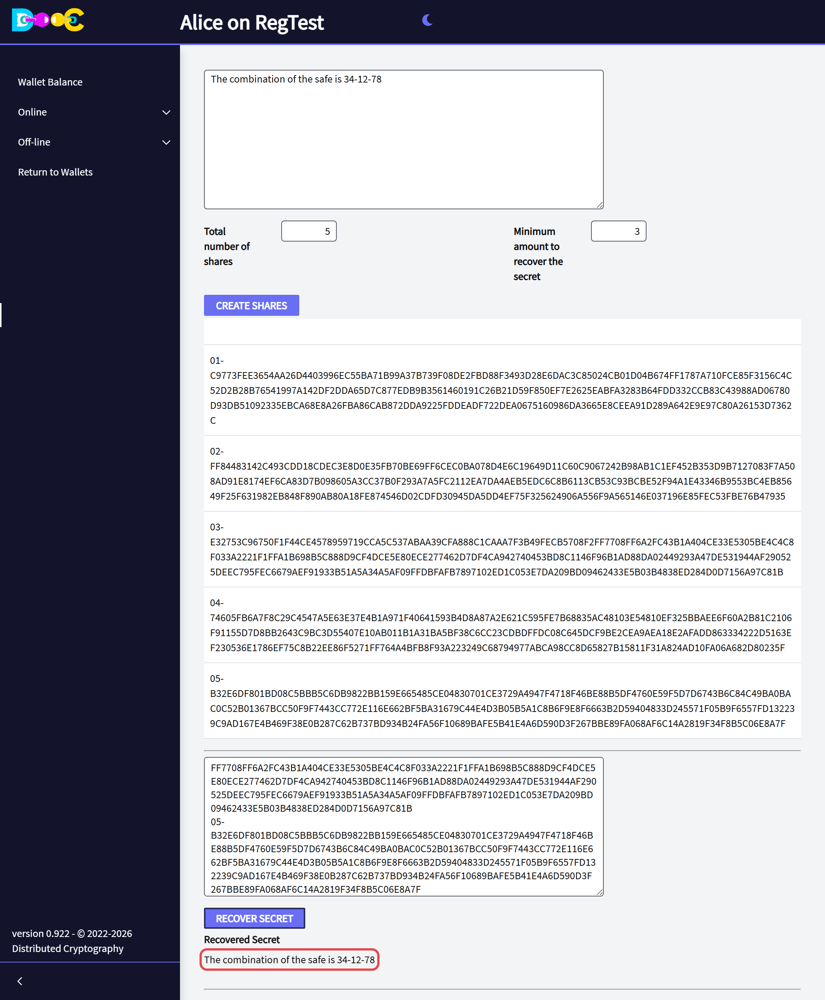

import { Steps } from '@astrojs/starlight/components';

**Off-line → Split a secret** cuts any secret (a password, a list of words, a combination) into several
**shares**. You decide how many shares there are, and how many are needed to rebuild the secret.

- Any group of shares that reaches the minimum rebuilds the secret.
- Fewer shares reveal **nothing** about it.

**Example:** 5 shares with a minimum of 3. You can lose two of them and still recover the secret, and someone
who finds two of them learns nothing.

## Split

<Steps>

1. Open **Off-line → Split a secret**.

   

2. Type the **secret**. Set the **total number of shares** and the **minimum amount to recover the secret**.
   Click **Create Shares**.

   

3. The shares appear below, one per box. Each share starts with its number (`01-`, `02-`, …) followed by a long
   text.

   

4. **Give each share to a different person, or keep each one in a different place.** Copy the whole share,
   including its number. You can turn a share into a picture with [Create QRCodes](/offline/qr-codes/).

</Steps>

:::caution
The shares are **not saved** by the application. When you leave the page they are gone, so copy them before you
do. And do not keep them all together: whoever has the minimum has the secret.
:::

## Recover

<Steps>

1. Open **Off-line → Split a secret**. In the second box, paste the shares you have, **one per line, each with
   its number**. You need at least the minimum. Click **Recover Secret**.

   

2. The secret appears under **Recovered Secret**.

   

</Steps>

If you paste fewer shares than the minimum, the page tells you there are not enough.

You do not need the wallet that made the shares: any wallet can recover the secret from them.

:::tip
This is the manual version of what a [Consensus Backup](/groups/consensus-backup/) does automatically for your
whole wallet, with encrypted delivery to each person and a warning to you when someone starts a restore.
:::
