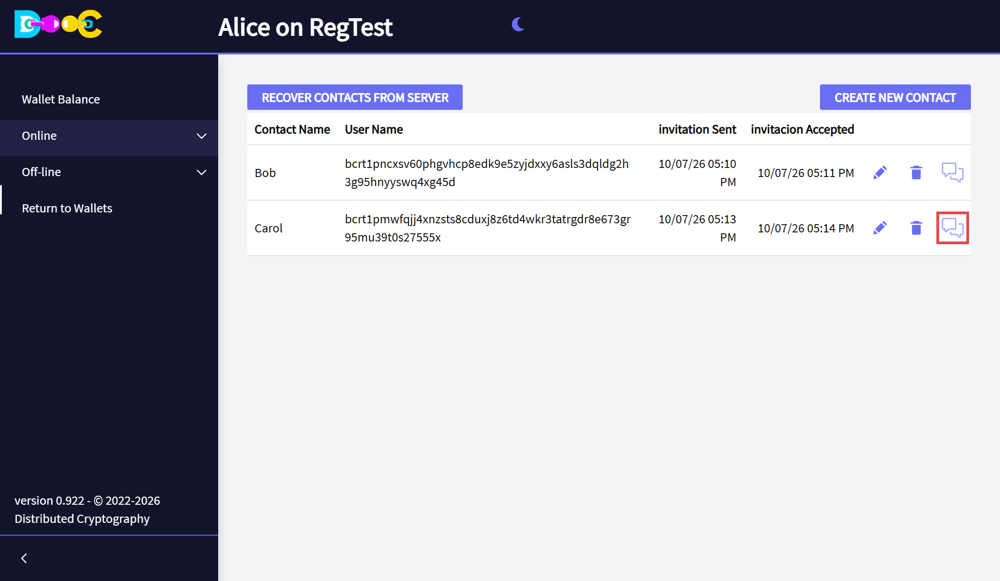
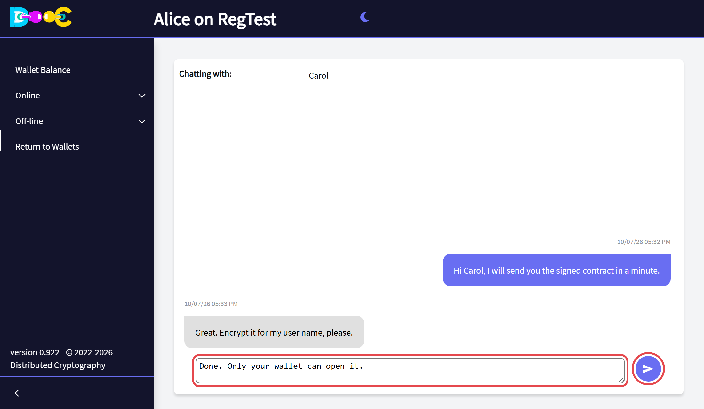
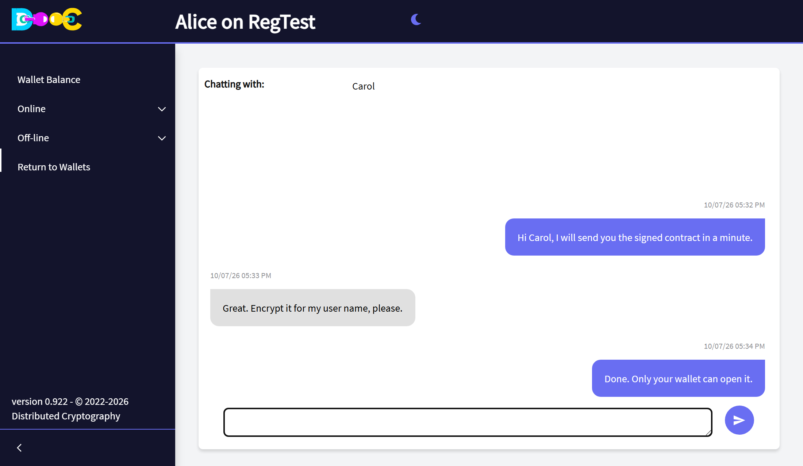
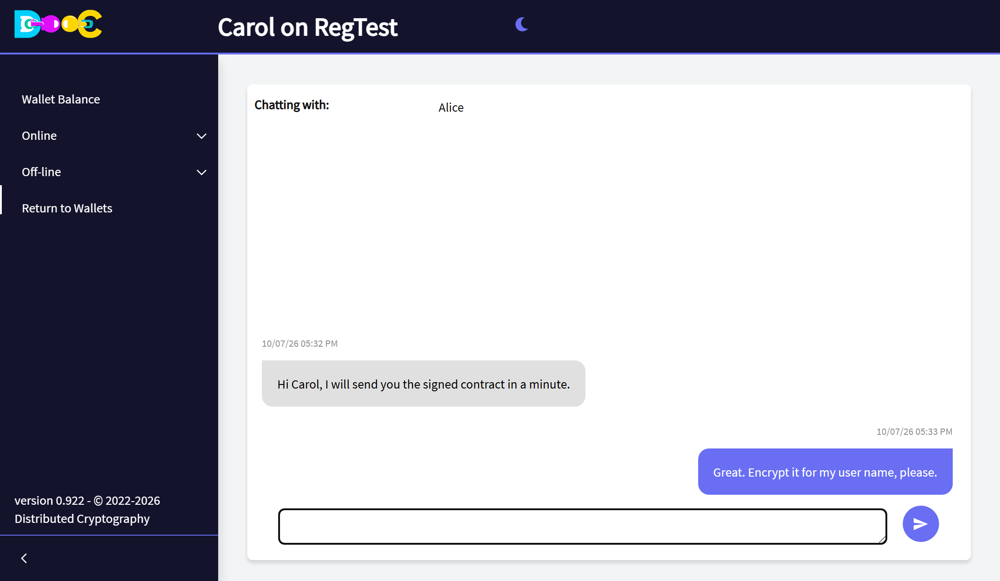

import { Steps } from '@astrojs/starlight/components';

You can chat with any [contact](/online/contacts/) that has accepted your invitation, or whose invitation you
accepted.

## Start a chat

<Steps>

1. Open **Online → Contacts** and click the **chat icon** on the contact's row.

   

   No chat icon? The invitation has not been accepted yet.

2. Type your message in the box at the bottom and click the **send** button.

   

3. Your messages are on the right, in colour. The messages of your contact are on the left. Each one shows its
   date and time.

   

</Steps>

Your contact sees the same conversation the other way round:

If the chat is open when a message arrives, it appears right away. If you are on another page, the app shows a
notice that you received a chat from that contact.

## How it is protected

- Every message is **encrypted on your computer for your contact's chat key**. Only their wallet can read it.
- Messages travel over [Nostr](https://nostr.com/) relays. A relay only sees encrypted data.
- The history of each conversation is stored on your computer, in your wallet folder, encrypted with a key of
  your wallet.

## Good to know

- **Your contact does not have to be connected.** The message waits on the relay and is delivered the next time
  they open their wallet.
- **Messages from people who are not your contacts are ignored.**
- **There is no "delivered" or "read" mark.**
- **The history stays on the computer where the chat happened.** It is not copied to our servers.
- You can choose which Nostr relays your wallet uses in **Online → User Info**.
