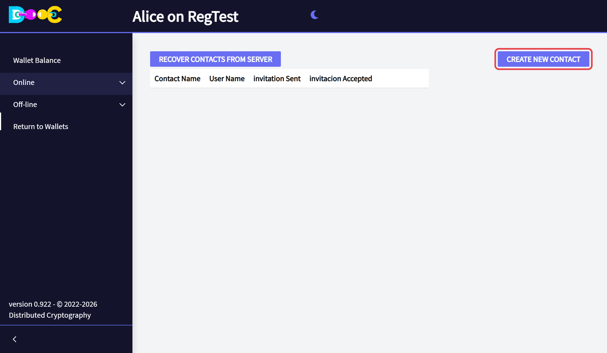
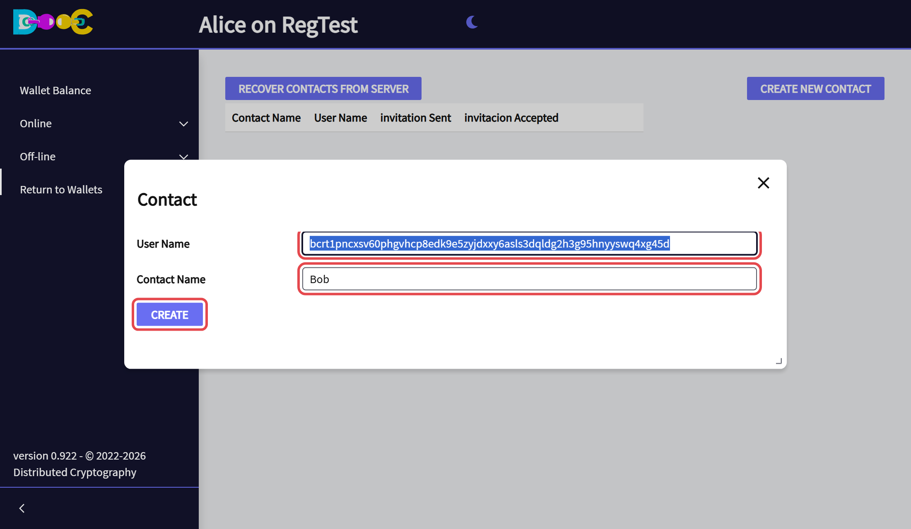
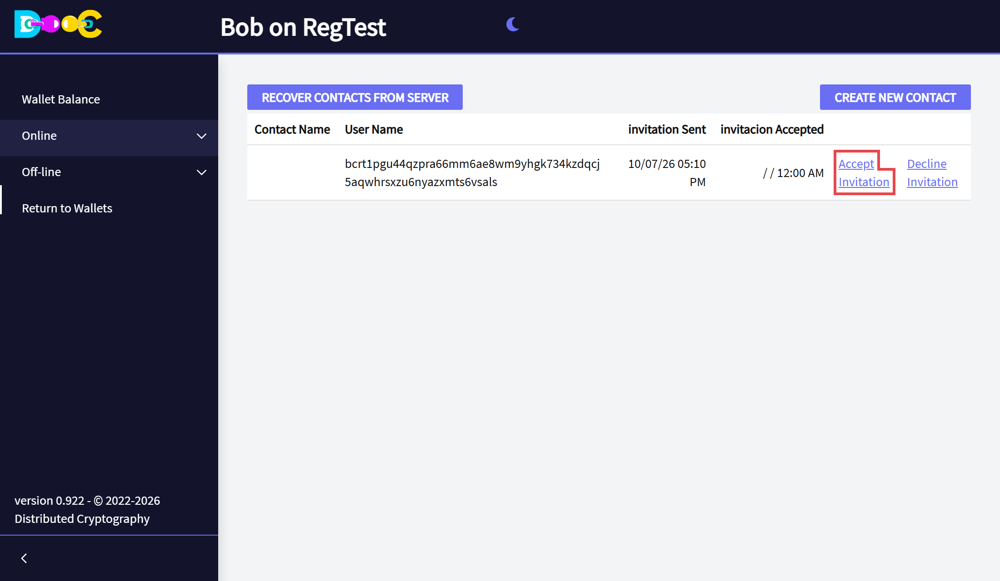
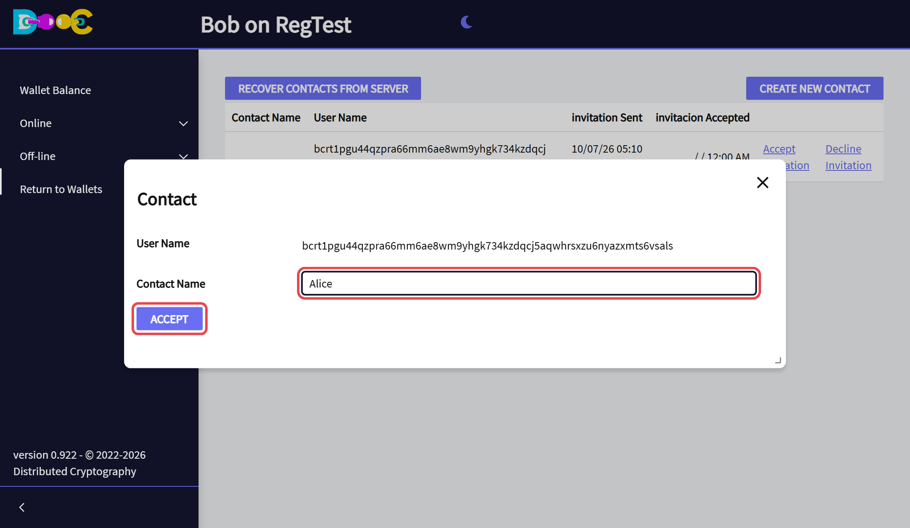
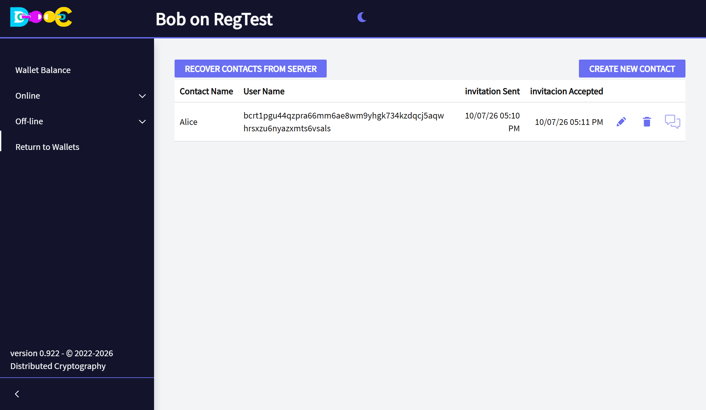
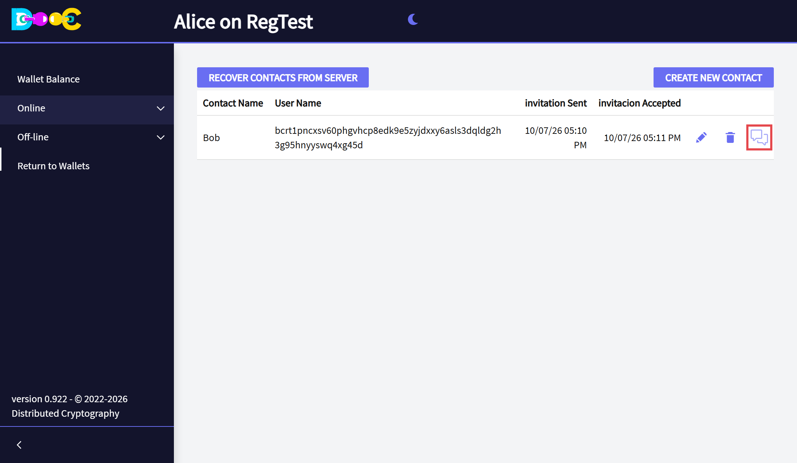

import { Steps } from '@astrojs/starlight/components';

A contact is another user you have connected with. You need contacts to [chat](/online/chat/) and to create
[Smart Groups](/groups/).

Connecting takes two steps: one person **invites**, the other **accepts**. During that exchange the two wallets
swap the public keys they will use later to encrypt chat and group messages for each other.

In this example **Alice invites Bob**.

## Invite someone (Alice)

<Steps>

1. Ask the other person for their **user name**. They find it in **Online → User Info**
   (see [Anonymous login](/online/#your-user-name)).

2. Open **Online → Contacts** and click **Create new contact**.

   

3. Paste their **user name**, and type a **contact name**: the name *you* want to see for this person. It is
   private; the other person never sees it. Click **Create**.

   

4. The contact is in your list, with the date in *invitation Sent*. *invitacion Accepted* is still empty.

   

</Steps>

## Accept an invitation (Bob)

<Steps>

1. Open your wallet. When an invitation has arrived, the app shows the message *There is a new Contact
   invitation*, and **Online → Contacts** has a new line with the user name of the person who invited you. Click
   **Accept Invitation**.

   

   Check that the user name is the one that person gave you.

2. Type the **contact name** you want to give this person and click **Accept**.

   

3. The contact now has a date in *invitacion Accepted* and three icons: edit, delete and **chat**.

   

</Steps>

## Back on the side of the person who invited (Alice)

The next time Alice opens her wallet, her list shows the contact as accepted, with the **chat icon**. That icon
is the sign that the contact is ready: you can [chat](/online/chat/) and invite the person to
[Smart Groups](/groups/).

:::note[Messages are not instant]
Invitations and answers travel as encrypted messages. They are delivered **when the other person opens their
wallet**, and it can take about a minute. If nothing has arrived, go back to the wallets page and open the
wallet again a little later.
:::

## Good to know

- **Invite each person once.** If both of you invite each other at the same time you end up with two crossed
  entries.
- **Declining is silent.** The person who invited you is not told.
- The **pencil** changes the name you gave the contact. The **trash can** deletes the contact.
- **Recover contacts from server** brings your contacts back on a new computer, after you restore your wallet
  and log in. The list is stored encrypted, and only your wallet can open it.
