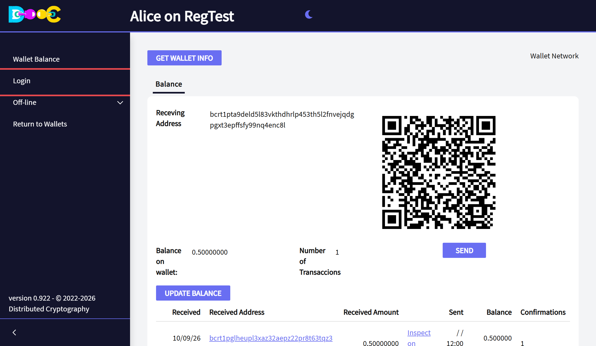
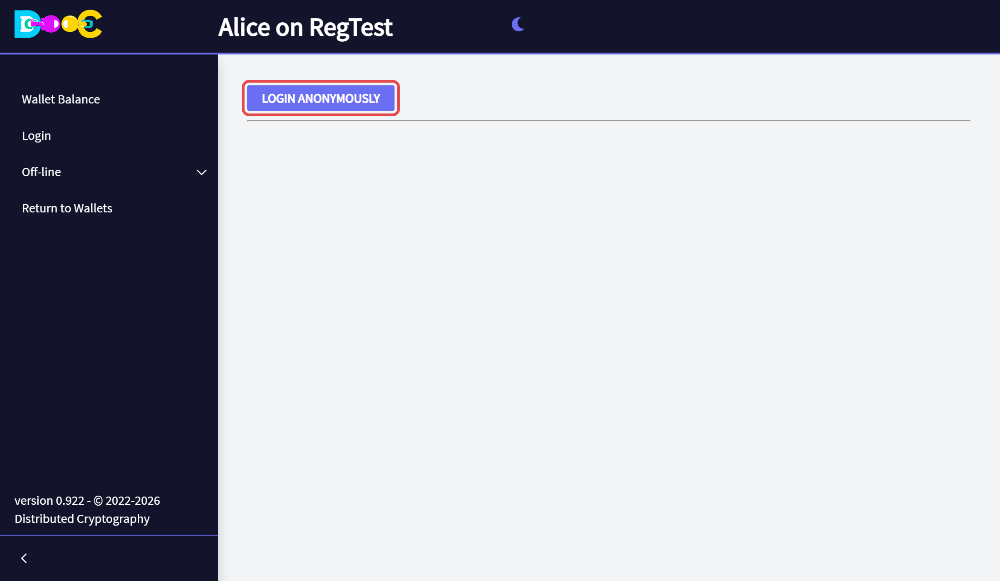
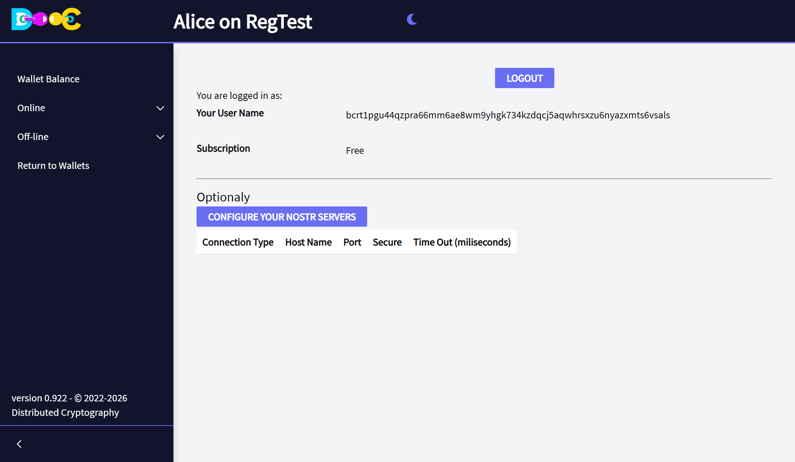

import YouTube from '../../../components/YouTube.astro';
import { Steps } from '@astrojs/starlight/components';

The online features (contacts, chat, sending files and Smart Groups) need a connection to our servers. You log
in **anonymously**: there is no form to fill in, no e-mail and no password to remember.

## How to log in

<Steps>

1. Open your wallet with its password. In the menu on the left click **Login**.

   

2. Click **Login Anonymously**.

   

3. After a moment the page shows **your user name**, and the menu has a new entry, **Online**.

   

</Steps>

The **Online** menu has *User Info* (this page), *Contacts*, *Smart Groups* and *File Encryption*.

You stay logged in: the next time you open the wallet, *Online* is already there.

## Your user name

Your user name is a long text that starts with `bc1p` (`tb1p` or `bcrt1p` on the test networks). It looks like a
bitcoin address because it is made the same way, from a key of your wallet that is only used for logging in. It
is not an address to receive bitcoin.

- **Give your user name to the people you want to connect with.** They need it to add you as a
  [contact](/online/contacts/) or to [encrypt a file](/online/send-files/) for you.
- **The same wallet always has the same user name.** If you restore your wallet on another computer and log in,
  you are the same user.

## What happens when you log in

The wallet proves to the server that it holds the key behind your user name by signing with it. This follows the
single sign-on mechanism of the OAuth protocol. The server answers with a **token**, which is stored in an
encrypted file inside your wallet folder. The token gives the application access to the online services.

## What the services do

- They check that a new contact really is the user it says it is.
- They keep an **encrypted backup of your contacts and groups**. It is encrypted on your computer before it is
  sent, so we cannot read it. See [What our servers can see](/security/privacy/).
- They deliver encrypted messages between users.

## Your own Nostr servers (optional)

[Chat](/online/chat/) messages travel over Nostr relays. **Configure your Nostr servers**, on the *User Info*
page, lets you choose which relays your wallet uses. You do not need to change anything to start.

## Log out

Open **Online → User Info** and click **Logout**. You can log in again at any time, and you will be the same
user.

## Video

<YouTube id="YgiQJ7BQyDs" title="User info and contacts" />
