import { Steps } from '@astrojs/starlight/components';

:::note[If you update from an earlier version]
Since version 0.923 files are encrypted in a new format (DCF2). Files encrypted with earlier versions cannot be
opened with it: decrypt them with the version that made them before you update.
:::

**Online → File Encryption** encrypts a file so that **only one user can open it**. You then send the encrypted
file any way you like: e-mail, a USB drive, a cloud folder. Whoever carries it, or finds it, cannot read it.

The encrypted file has the extension **`.dcf`**. Even the original file name is encrypted inside it.

The page has three tabs:

| Tab | Use it for |
|---|---|
| **Encrypt for a user** | Encrypting a file of up to 1 GB. The file goes through your browser. |
| **Received from a User** | Opening a `.dcf` file of up to 1 GB that somebody encrypted for you. |
| **Large files (no upload)** | Files of any size, in both directions. The files are read and written directly on the disk. |

In this example **Alice sends a file to Bob**.

## Encrypt a file for someone (up to 1 GB)

You need the **user name** of the person. They find it in **Online → User Info**
(see [Anonymous login](/online/#your-user-name)). They do not have to be one of your contacts.

<Steps>

1. Open your wallet, [log in](/online/) if you have not done so, and open **Online → File Encryption**. You are
   on the tab **Encrypt for a user**.

   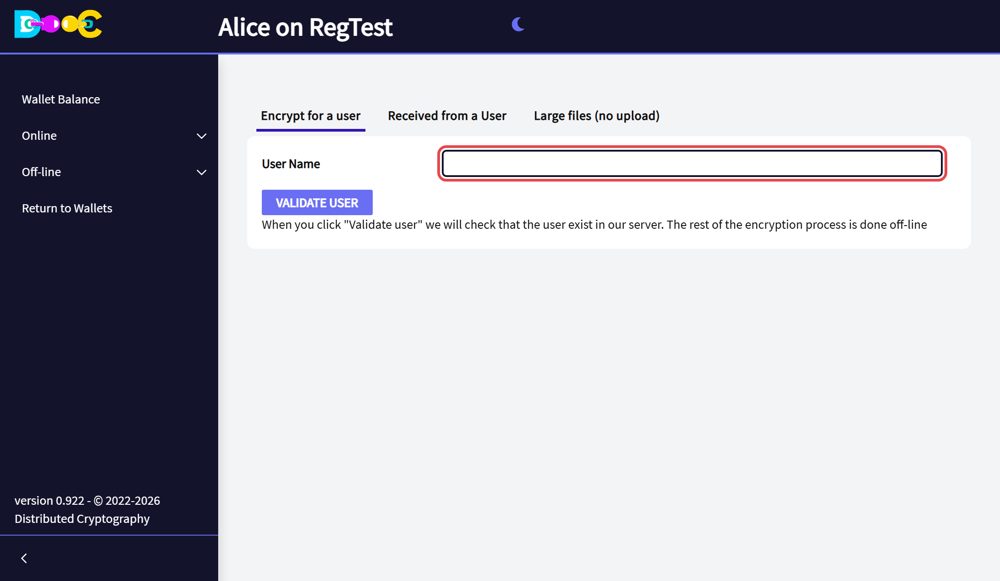

2. Paste the **user name** of the person and click **Validate user**.

   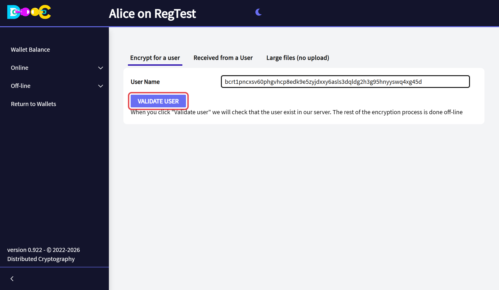

   This is the only step that uses our server: it checks that the user exists and gets their public key. The
   encryption itself is done on your computer.

3. Click **Add files...** and choose the file, or drop it on **Drop files here**.

   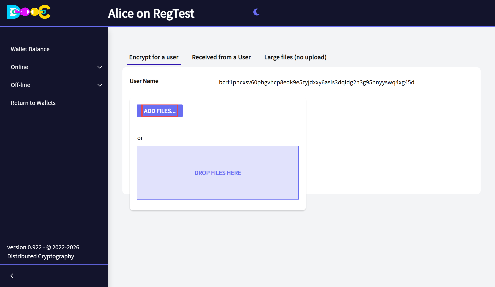

4. The app shows **File encrypted! Check your download folder**. Your browser has saved
   **`<original name>.dcf`** in your downloads folder.

   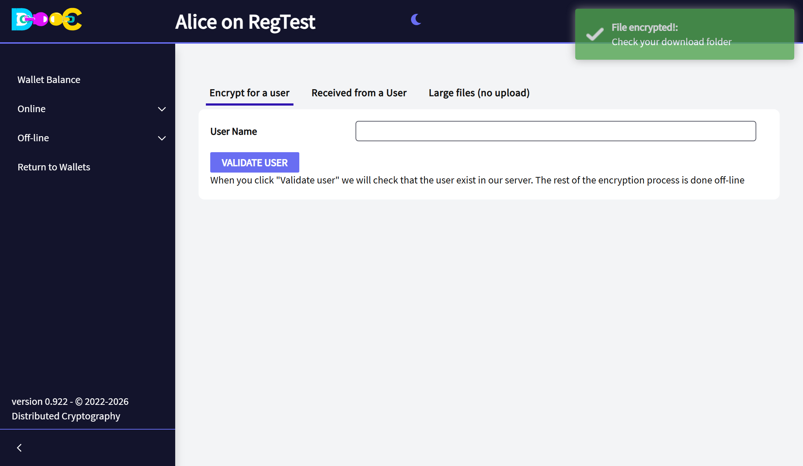

5. **Send the `.dcf` file** to the person, any way you like.

</Steps>

## Open a file you received (up to 1 GB)

<Steps>

1. Open **the wallet the file was encrypted for**. That wallet must have logged in at least once; you do not
   need a connection to decrypt.

2. Open **Online → File Encryption** and click the tab **Received from a User**.

3. Click **Add files...** and choose the `.dcf` file, or drop it on the page.

   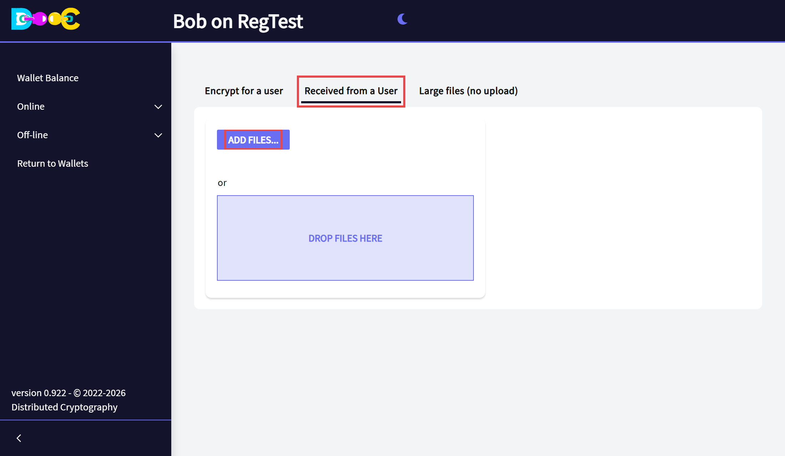

4. The app shows **File decrypted! Check your download folder**. Your browser has saved the file with its
   **original name**.

   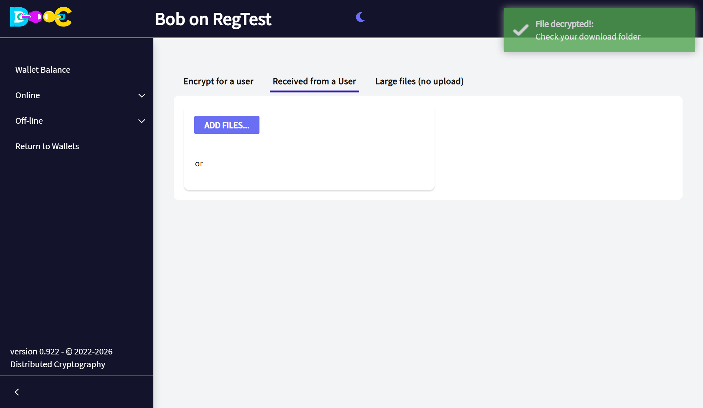

</Steps>

If the file was made for another wallet, or it was changed or damaged, the app says so and nothing is
downloaded.

## Large files (no upload)

A browser cannot upload more than 1 GB. For larger files, or whenever you prefer not to upload them, the app
works directly on the disk of the computer that runs it, in the wallet's **file exchange folder**:

```
<exchange folder>/
    To encrypt/    put here the files you want to send
    To send/       the app writes the encrypted .dcf files here
    Received/      put here the .dcf files you received
    Decrypted/     the app writes the original files here
```

Open **Online → File Encryption** and click the tab **Large files (no upload)**. The text at the top of the tab
shows the **full path of each folder** on your computer.

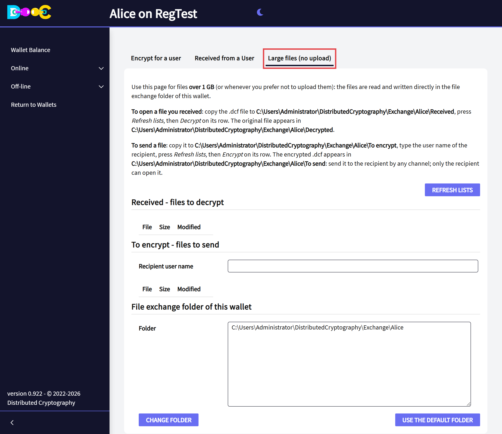

### Encrypt a large file

<Steps>

1. With your file manager, **copy the file to the folder *To encrypt*** shown on the page.

2. Paste the **user name** of the person in **Recipient user name** and click **Refresh lists**. Your file
   appears under *To encrypt - files to send*. Click **Encrypt** on its row.

   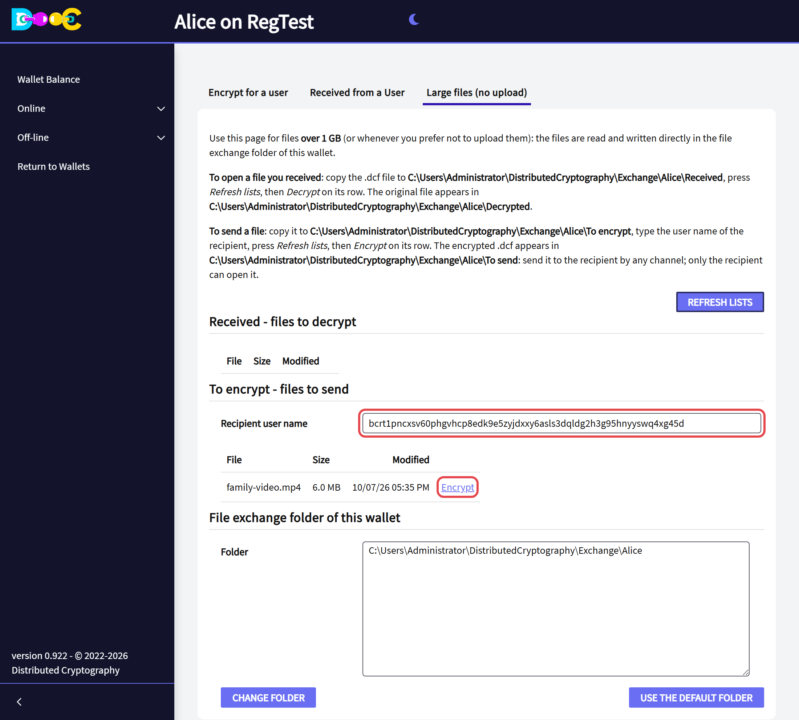

3. The app shows **File encrypted** with the full path of the new file. It is in the folder ***To send***, with
   the name `<original name>.dcf`.

   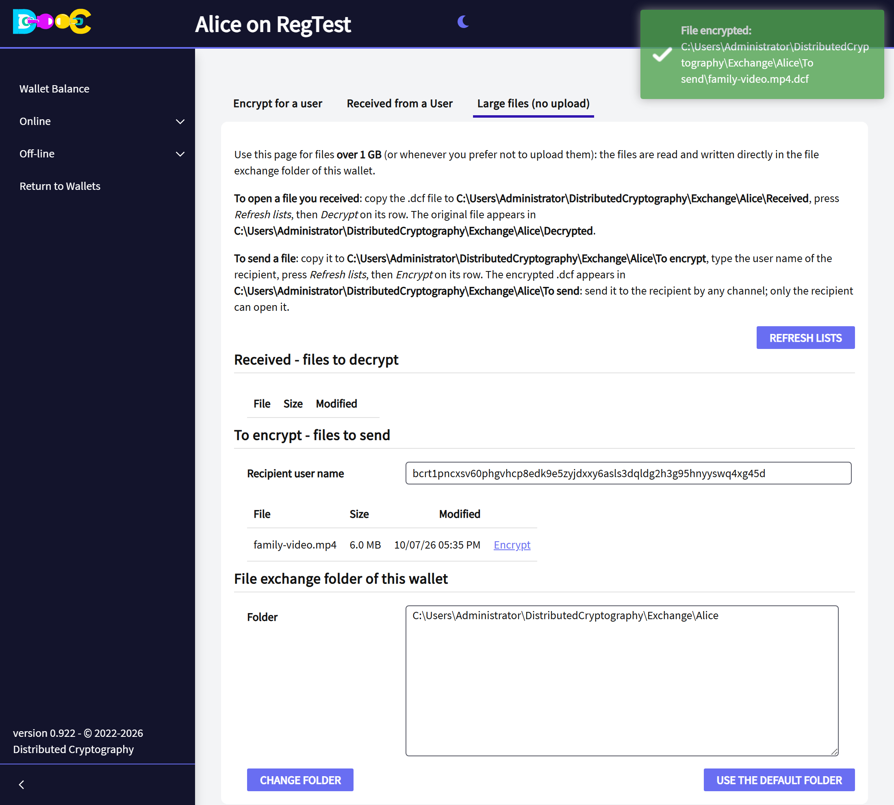

4. **Send the `.dcf` file** to the person, any way you like. The original stays in *To encrypt*: delete it
   yourself when you no longer need it there.

</Steps>

### Decrypt a large file

<Steps>

1. Open the wallet the file was encrypted for and go to the tab **Large files (no upload)**.

2. With your file manager, **copy the `.dcf` file to the folder *Received*** shown on the page.

3. Click **Refresh lists**. The file appears under *Received - files to decrypt*. Click **Decrypt** on its row.

   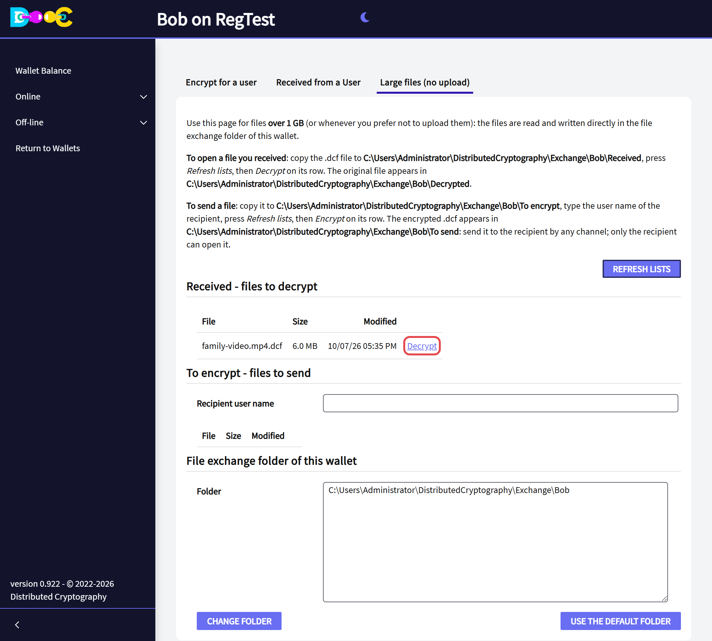

4. The app shows **File decrypted** with the full path of the result. The original file is in the folder
   ***Decrypted***, with its original name.

   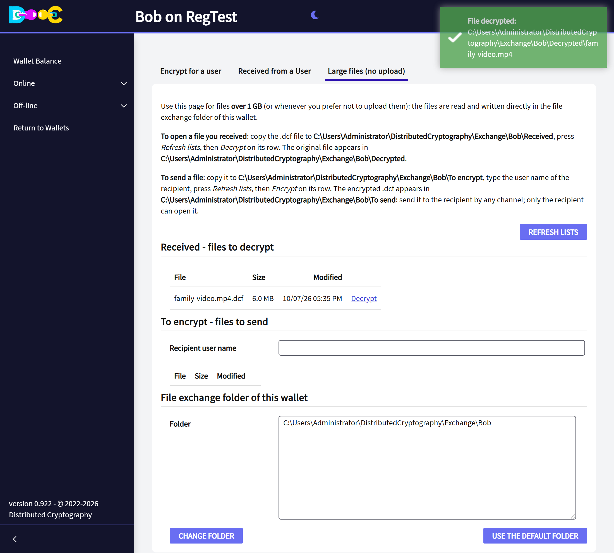

</Steps>

A file that was made for another wallet, or that was changed or cut, gives a message and leaves nothing in
*Decrypted*.

:::caution[The app does not delete anything from these folders]
The originals in *To encrypt* and the opened files in *Decrypted* stay on the disk **unencrypted** until you
delete them yourself.
:::

### Where the exchange folder is

By default the exchange folder of a wallet is `Exchange/<wallet name>` inside the application's data folder,
which is `DistributedCryptography` in your user folder:

| System | Data folder |
|---|---|
| Windows | `C:\Users\<user>\DistributedCryptography` |
| Linux | `/home/<user>/DistributedCryptography` |
| Mac | `/Users/<user>/DistributedCryptography` |

**To use another folder for one wallet** (an external disk, a network share), type its full path in **Folder**,
at the bottom of the tab, and click **Change folder**. The four folders are created there at once.
**Use the default folder** goes back.

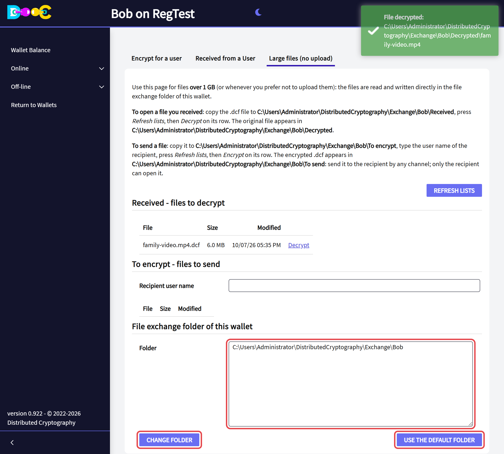

**To move all the application's data**, set the environment variable `DISTCRYPT_DATA_DIR` before starting the
application. In a container, point it to a mounted volume so that the files survive the container and you can
copy files in and out from the host.

An existing file is never overwritten: a second file with the same name is called `name (2).ext`.

## From the command line

`adcfencrypt` encrypts a file of any size without opening a wallet. It works offline and only needs the
recipient's public key, so it is useful in scripts and on servers. It is in the `bin` folder of the application.

```
adcfencrypt <publicKey> <source> <destination>
```

| Argument | Meaning |
|---|---|
| `publicKey` | The recipient's file-encryption public key: 66 hexadecimal characters |
| `source` | The file to encrypt |
| `destination` | The encrypted file to create, or an existing folder (then `<source name>.dcf` is created in it) |

```
adcfencrypt 024ca15db1720b... "D:\video.mp4" "D:\video.mp4.dcf"
adcfencrypt 024ca15db1720b... backup.zip E:\to-send\
```

It never overwrites an existing file, and an interrupted run leaves nothing behind. Run it without arguments to
see the help.

| Exit code | Meaning |
|---|---|
| 0 | Done |
| 1 | Help was shown |
| 2 | An argument is not valid (the key, a missing file or folder) |
| 3 | The destination already exists |
| 4 | The encryption failed |

The file it makes is opened like any other `.dcf` file, with the tabs described above.

## How the file is protected

- A **new random key** is created for every file and locked with the recipient's public key. Only the
  recipient's wallet can unlock it.
- The content is encrypted in pieces with **AES-256-GCM**.
- **Any change is detected:** a file that was modified, cut, extended or rearranged is rejected, and no partial
  result is written.
- Files you decrypt in the browser are handed over through a private, one-time download and are deleted from
  the application as soon as they have been sent.

More detail in [How your data is protected](/security/).
