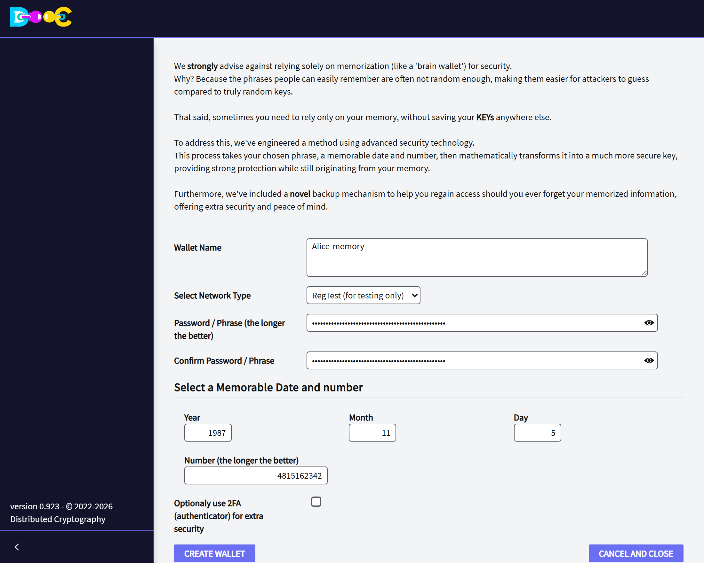

import { Steps } from '@astrojs/starlight/components';

An **Advance Brain Wallet** is a wallet made only from things you remember: **a phrase, a date and a number**.
There are no words to write down and no file to carry. The same three things give the same wallet on any
computer, today or in twenty years.

:::caution[Read this first]
We strongly advise against keeping bitcoin **only** in your memory.

- The phrases people remember easily are usually easy to guess. Anyone who guesses your phrase, date and number
  owns the wallet, and they can try from anywhere: they do not need your computer.
- If you forget **any** of the three, the wallet cannot be rebuilt.

Use it when you really need a wallet that exists only in your head, choose the three things as explained
[below](#choosing-the-phrase-the-date-and-the-number), and protect it with a
[Consensus Backup](/groups/consensus-backup/) in case you forget.
:::

## Why "advance"

A classic brain wallet turns a phrase into a key with one fast calculation, so a thief can try billions of
phrases per second. Here the key is made with **Argon2id**, a calculation built to be slow and to need a lot of
memory (640 MiB, several seconds on a normal computer), and the date and the number take part in it. Every
guess costs the thief that same time and memory, which makes guessing millions of times more expensive. It does not make a weak phrase safe: it makes a good one very hard to break. The details are in
[How your data is protected](/security/#advance-brain-wallet).

## Create it

<Steps>

1. On the wallets page click **Create/Restore Advance Brain Wallet**.

2. Type a **name** for the wallet and choose the **network**.

3. Type your **phrase**, twice.

4. Type the **date** (year, month and day, in numbers) and the **number**.

   

5. Click **Create Wallet**. The calculation takes a few seconds and needs about 1 GB of free memory. The wallet
   then appears in the list.

</Steps>

To open the wallet on this computer, the password is **the phrase**.

## Choosing the phrase, the date and the number

- **The phrase:** five or six words that have nothing to do with each other are much stronger than a sentence
  that makes sense. Do not use a quotation, a line of a song, a saying or anything that is written somewhere.
  It can have up to 100 characters.
- **The date:** not your birthday, nor a date that other people connect with you.
- **The number:** the longer the better, eight digits or more. Not your telephone or document number.

The three are used **exactly as you type them**:

- In the phrase, capital letters, spaces and accents count. `Blue horse` and `blue horse` are different wallets.
- Type the year with its four digits. `85` and `1985` are different wallets.
- In the number, zeros at the beginning do not count: `007` is the same as `7`.

:::tip[Check that you remember it]
Right after creating the wallet, create it **again with another name**, typing everything from memory. Open
both and compare the receiving address: it must be the same. Do it again a few days later, before you send
bitcoin to the wallet.
:::

## Get it back

Getting the wallet back is creating it again: the same page, the same phrase, date and number. Any computer
with the application will do.

Use a wallet **name that is not in the list**. If a wallet with that name already exists, it is kept as it is and
nothing new is created.

If the wallet you get is empty and should not be, one of the three things is not exactly what you typed the
first time. The application cannot tell you which one: every combination is a valid wallet.

## What stays on the computer

Like every wallet, it is saved in the wallets folder, encrypted with its password, which here is the phrase.

- On a computer that has the wallet, **the phrase alone opens it**. The date and the number are needed to build
  the wallet, not to open a copy that is already there.
- If you chose to use an authenticator (2FA), it belongs to the copy on that computer. A wallet built again
  from memory on another computer does not ask for it.

## If you forget

Nobody can recover the phrase, the date or the number for you. What can bring the wallet back is a
[Consensus Backup](/groups/consensus-backup/): people you trust hold pieces of the key, and together they return
the wallet to you. Set it up while you still remember.

## Next

- [Create a wallet with words](/wallet/create/), the recommended way
- [Consensus Backup](/groups/consensus-backup/)
