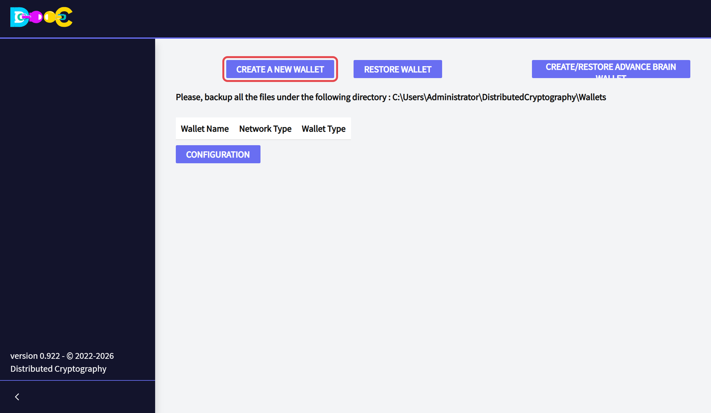
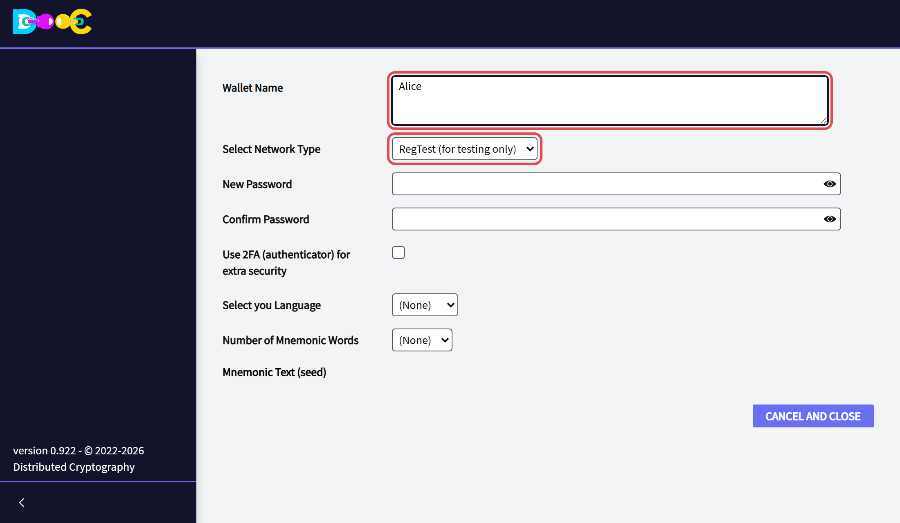
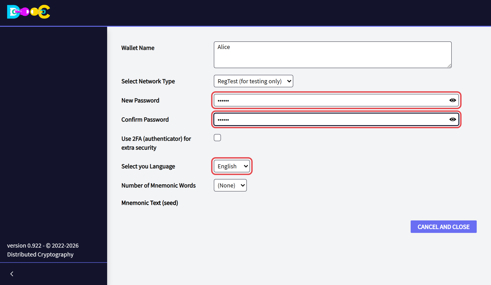
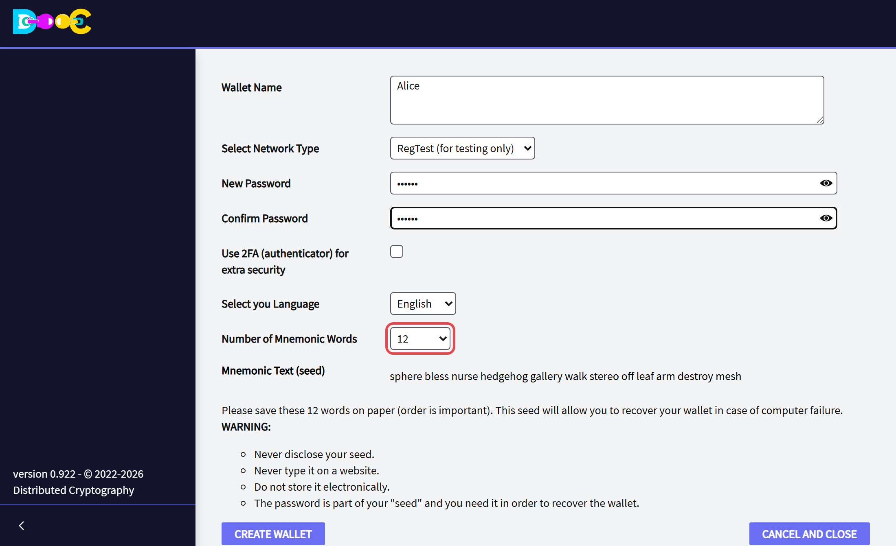
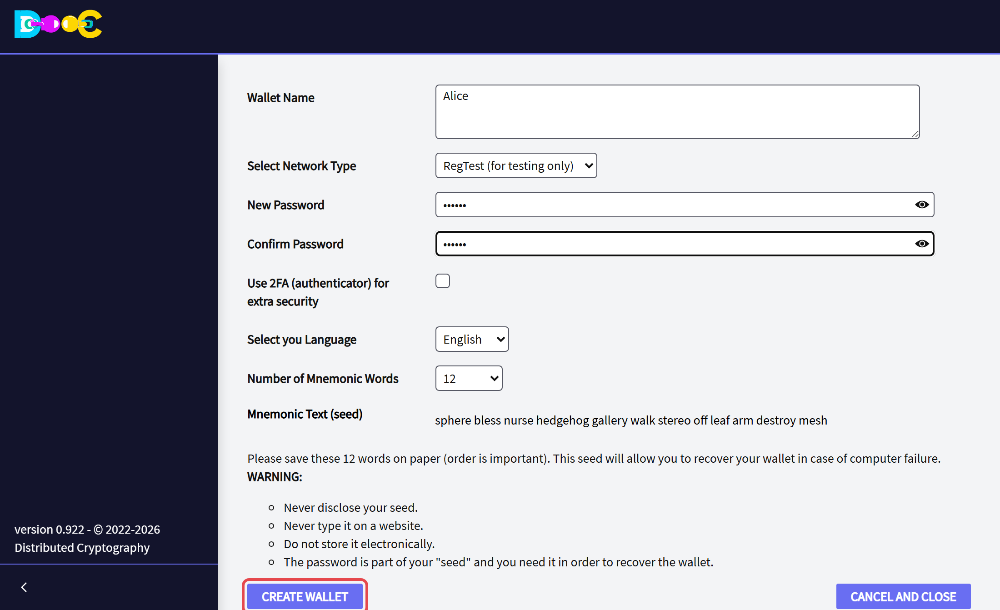
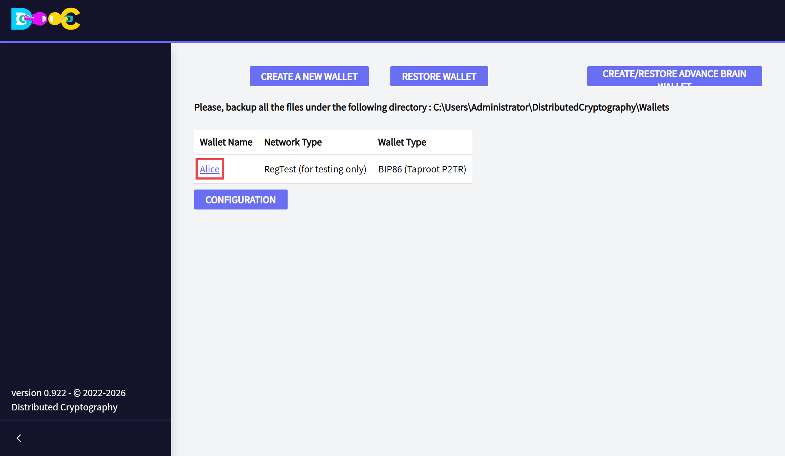
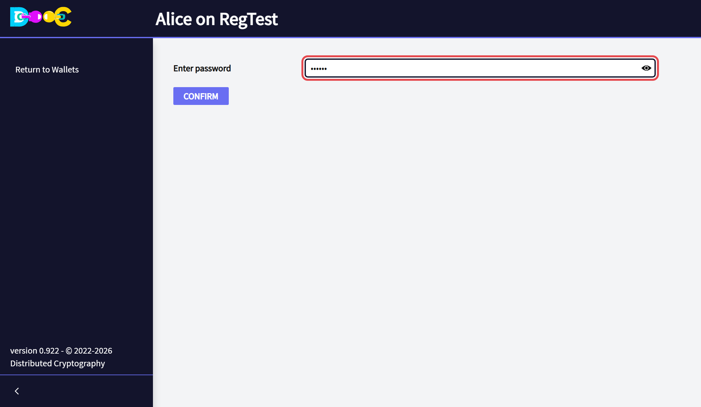
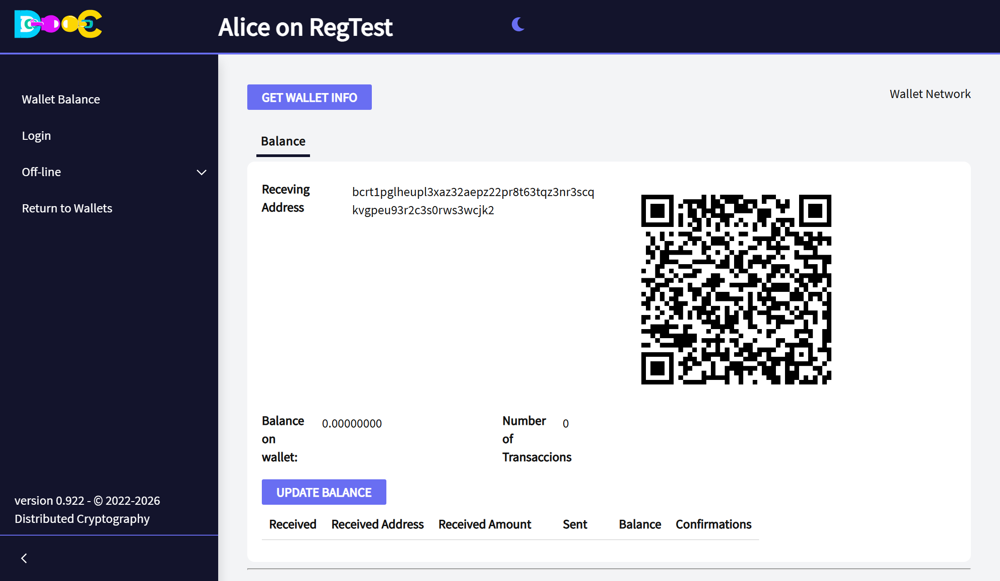
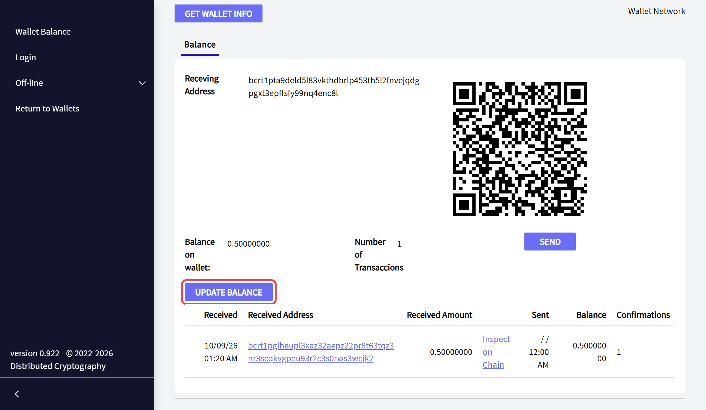

import YouTube from '../../../components/YouTube.astro';
import { Steps } from '@astrojs/starlight/components';

:::danger[Your password is part of your wallet]
The password you choose is used together with your words to make the keys. **The words alone do not restore the
wallet.** The same words with another password give a different, empty wallet. Keep the words and the password
safe, and keep them in different places.
:::

In the pictures, the red frame shows what to click or fill in at each step.

## Create the wallet

<Steps>

1. **Open the application.** The first page lists the wallets of this computer. Click **Create a New Wallet**.

   

   The page also shows the folder where your wallets are stored. [Back it up](/install/#after-installing) from
   time to time.

2. **Type a name** for the wallet and **choose the network**.

   - **MainNet** is for real bitcoin.
   - The test networks use coins that have no value. They are for trying things out; this guide uses one of
     them.

   

3. **Type a strong password**, twice, and choose the **language** of the words.

   

   *Use 2FA (authenticator) for extra security* is optional: see
   [Protect the wallet with an authenticator](#optional-protect-the-wallet-with-an-authenticator).

4. **Choose the number of words** (12 to 24). The wallet creates the words and shows them.

   

5. **Write the words down on paper, in order.** With them and your password you can restore the wallet if
   something happens to your computer.

   - Never show them to anybody.
   - Never type them on a web site.
   - Do not keep them in a file, a photo or an e-mail.

6. Click **Create Wallet**. It takes a few seconds: the wallet is being encrypted with your password.

   

7. The new wallet appears in the list.

   

</Steps>

## Open the wallet

<Steps>

1. Click the **name of the wallet** in the list.

2. Type your **password** and press **Enter**.

   

3. The wallet opens on **Wallet Balance**. The top of the page shows the name of the wallet and its network.

   

</Steps>

The menu on the left has:

- **Wallet Balance**: this page.
- **Login**: [log in anonymously](/online/) to use contacts, chat and Smart Groups. After you log in, this entry
  becomes **Online**.
- **Off-line**: the [offline tools](/offline/).
- **Return to Wallets**: closes the wallet.

## Receive bitcoin

<Steps>

1. Give the **receiving address** to the person who pays you: copy the text, or let them scan the QR code.

2. After the payment has been sent, click **Update Balance**.

   

</Steps>

The page shows the balance, the number of transactions, and one line for each payment with its amount and its
confirmations. *Inspect on Chain* shows the payment on the blockchain.

After a payment arrives, the wallet shows a **new receiving address**. Using a new address for each payment
protects your privacy. The old addresses keep working.

## Send bitcoin

Click **Send** on the balance page. Every payment asks for your password again.

## Optional: protect the wallet with an authenticator

When you create the wallet you can tick **Use 2FA (authenticator) for extra security**. The page shows a QR code
to scan with an authenticator app (Google Authenticator, for example). From then on the wallet asks for the
password **and** the current 6-digit code of the app.

## Video

<YouTube id="6B90oUuEFFA" title="Creating your first wallet" />

The video was recorded with an earlier version. The pages look a little different today, but the steps are the
same.

## What comes next

- Protect the wallet with a [Consensus Backup](/groups/consensus-backup/).
- Try the [offline tools](/offline/): encrypted notes, files, passwords and more.
- [Log in anonymously](/online/) to use contacts, chat and Smart Groups.
