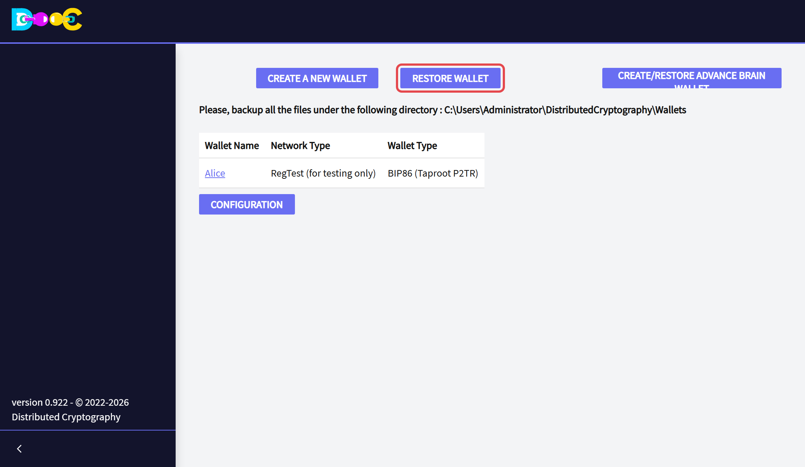
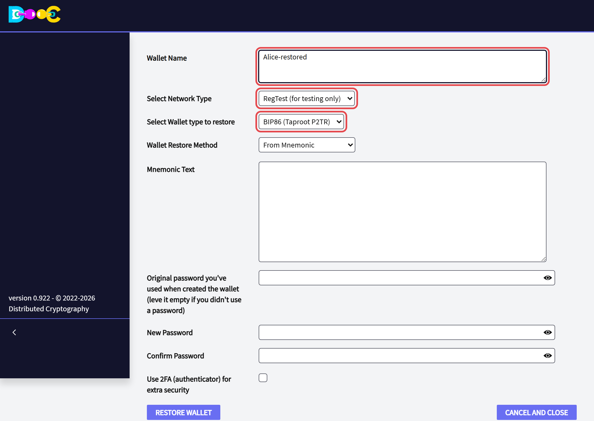
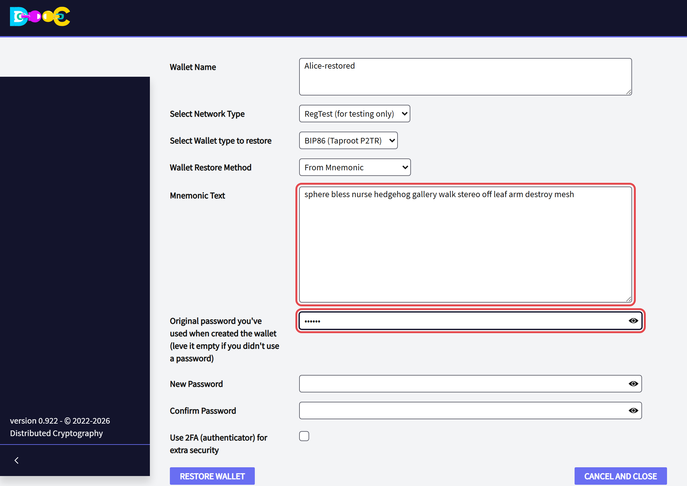
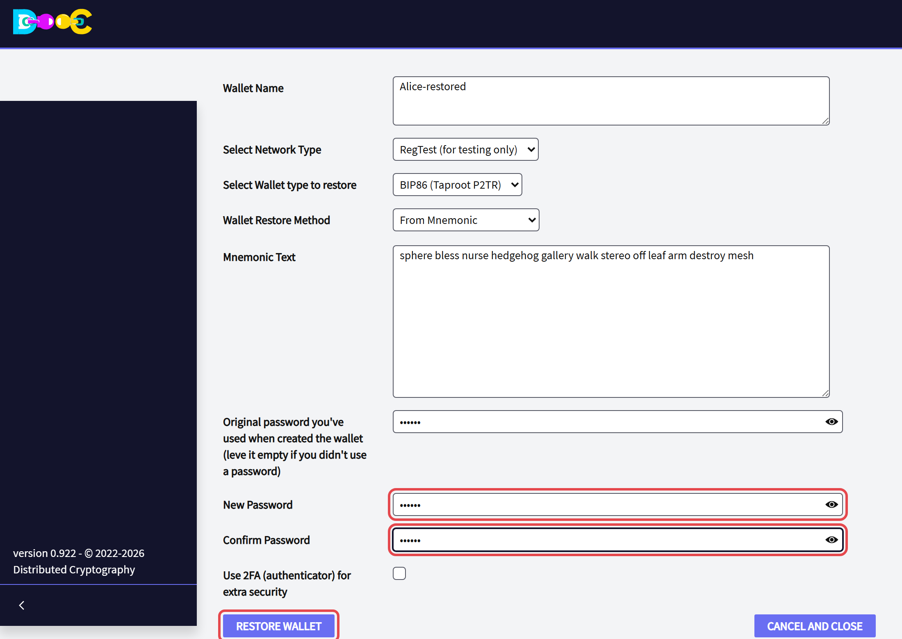

import YouTube from '../../../components/YouTube.astro';
import { Steps } from '@astrojs/starlight/components';

There are two ways to get a wallet back: with **your words**, or with the help of the people in your
**Consensus Backup**.

## From your words

You need the words **and** the password the wallet had when it was created.

<Steps>

1. On the wallets page click **Restore Wallet**.

   

2. Type a **name** for the wallet, choose the **network**, and choose the **wallet type**. A wallet created with
   this application is **BIP86 (Taproot P2TR)**.

   

3. Leave the restore method on **From Mnemonic** and type **your words**, in order, separated by spaces.

4. In **Original password you've used when created the wallet**, type the password the wallet had **when it was
   created**.

   

5. Type the **new password** for this wallet, twice. It can be the same as before or a new one. Then click
   **Restore Wallet**.

   

</Steps>

The restored wallet appears in the list. Open it and click **Update Balance**.

:::caution[Two passwords, two different jobs]
- The **original password** belongs to the words. It must be exactly the password you used when you created the
  wallet. With another one you get a valid wallet, but a different and empty one.
- The **new password** only protects the wallet on this computer.

Your backup is still "the words + the **original** password", even if you chose a new password here.
:::

<YouTube id="7jYyV7g01CM" title="Restoring your wallet" />

### After restoring

- Your **bitcoin** is back as soon as the balance is updated.
- [Log in](/online/): you are the same user as before. Then use **Recover contacts from server** (in *Contacts*)
  and **Recover groups from server** (in *Smart Groups*).
- Your encrypted notes, files and passwords were stored in the wallet folder of the old computer. They come back
  only if you kept a copy of that folder.

## From a Consensus Backup

If you created a [Consensus Backup](/groups/consensus-backup/), the members of the group can restore your wallet
without your words. The minimum number of members you chose has to take part.

<YouTube id="sRo47Et5k1I" title="Restoring a Consensus Backup" />

## Wallets made with other software

*Restore Wallet* also imports other kinds of wallet. Choose the type that matches the wallet you have:

| Type | What it is |
|---|---|
| **BIP86** | Taproot wallets (addresses that start with `bc1p`). Our default. |
| **BIP84** | Native SegWit wallets (addresses that start with `bc1q`) |
| **BIP49** | SegWit wallets with addresses that start with `3` |
| **BIP44** | Legacy wallets (addresses that start with `1`) |
| **Imported WIF** | One single private key in WIF format |
| **Brain wallet** | A wallet made from a phrase. Not recommended. |

For the BIP types you can restore **from the words** or **from a COLDCARD backup file**. If the wallet had no
passphrase, leave the original password empty.
